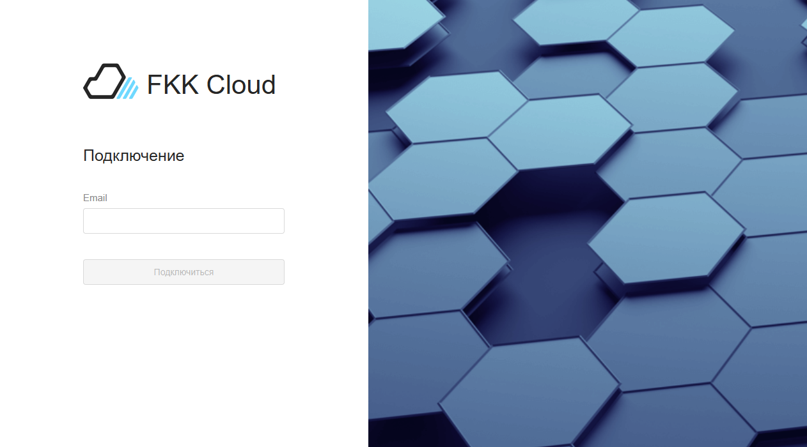
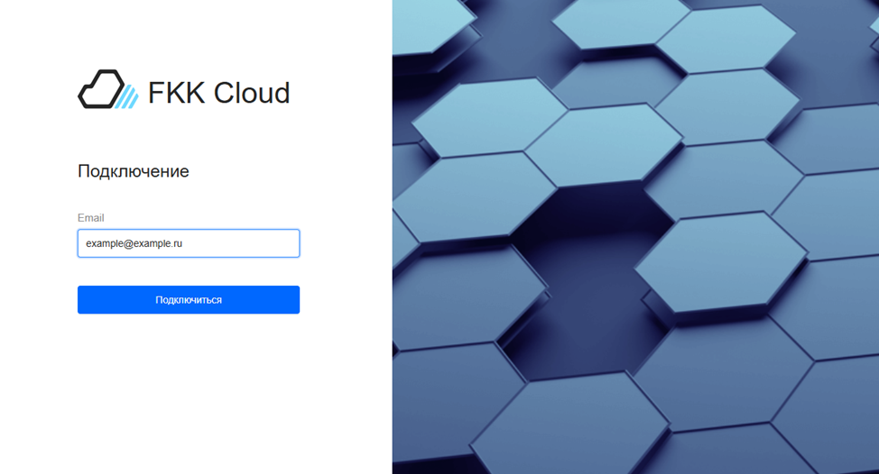
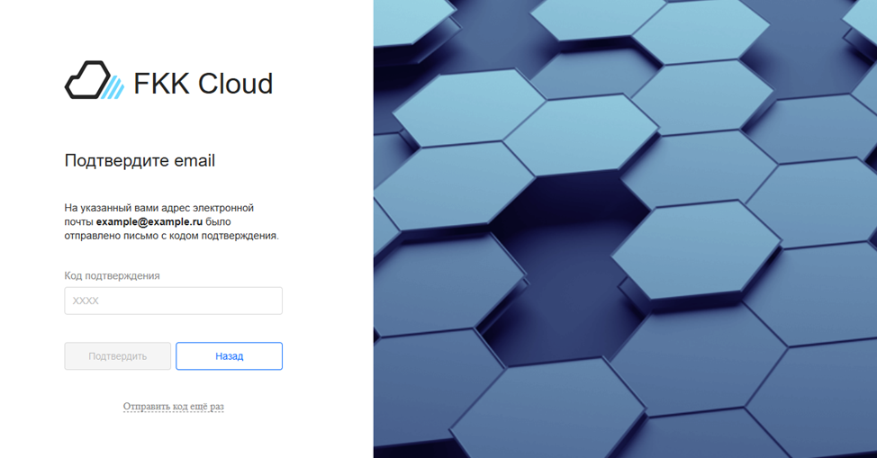
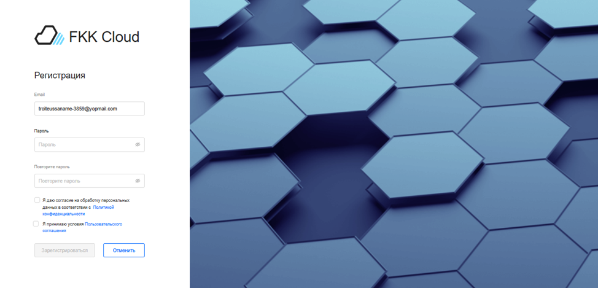

# Регистрация в FKK Cloud

## Порядок регистрации пользователя

Эта инструкция поможет вам зарегистрироваться в FKK Cloud. Доступ к сервисам FKK Cloud появится, когда пройдены все этапы регистрации:

### Подключение

1. Перейдите на [главную страницу сайта FKK Cloud](https://cloud.fkk.ru "cloud.fkk")

2. В появившемся окне заполните поле "Email" - поле проверяется на валидность адреса. После ввода адреса электронной почты, активируется кнопка "Подключиться"



Максимальная длина email 254 символа, минимальная - 6 символов

Недопустимы:

* Русские буквы (кириллица)

* Смешанные языки (например, user@домен.рф)

* Пробелы в любой части email



### Подтверждение электронной почты 

1. Дождитесь письма от FKK Cloud с темой «Код подключения на cloud.fkk.ru» и текстом _XXXX — ваш код подключения на cloud.fkk.ru_

2. При необходимости запросите письмо повторно: нажмите кнопку **Отправить код еще раз** в форме Подтвердите email.

### Регистрация

1. В появившемся окне заполните поля:

* **Пароль**

Пароль должен содержать минимум 8 символов включая заглавные и строчные буквы латинского алфавита,
цифры или символы: ? ! ~ @ # $ % ^ & _ - + * = ; : , . / \ | ` [ ] { } ( )

* **Повторите пароль**

Пароли должны совпадать

2. Необходимо проставить галочки для использования FKK Cloud 

* [Пользовательское соглашение](https://fclouddbs.hb.ru-msk.vkcloud-storage.ru/docs/19052025_Пользовательское%20соглашение%20для%20сервиса%20FKK%20Group_v.0.2.pdf "Перейти")

* [ПОЛИТИКА ОБРАБОТКИ ПЕРСОНАЛЬНЫХ ДАННЫХ](https://fclouddbs.hb.ru-msk.vkcloud-storage.ru/docs/25052025_Политика%20ФКК%20Групп%20для%20сайта%20и%20общая.pdf "Перейти")
