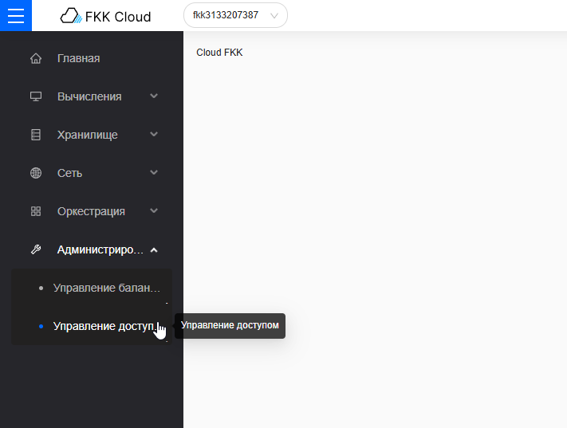
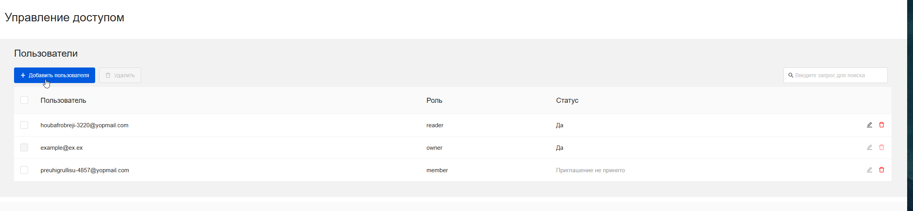

## Добавление пользователя

Чтобы перейти к просмотру пользователей проекта необходимо:

1. Авторизоваться в FKK Cloud https://cloud.fkk.ru.

2. Перейти в управление доступом.

### Реализация

1. Нажать кнопку "✚ Добавить пользователя"

2. Во всплывающей окне заполнить поля: Email пользователя, роль пользователя 



Максимальная длина email 254 символа, минимальная - 6 символов





Доступные роли для пользователей: member, reader



3. Нажать кнопку "Добавить пользователя"

4. Пользователь появиться среди пользователей проекта со статусом "Приглашение не принято"



Чтобы принять приглашение в проект, необходимо приглашенному пользователю перейти по ссылке-приглашению отправленному ему на электронную почту. 

Переход по ссылке откроет страницу подключения или авторизации в зависимости от статуса пользователя в облаке.

Как только пользователь зайдет в ЛК, новый проект будет отражаться в меню проектов в окошке сверху, а у owner проекта статус пользователя поменяется на "Да"



