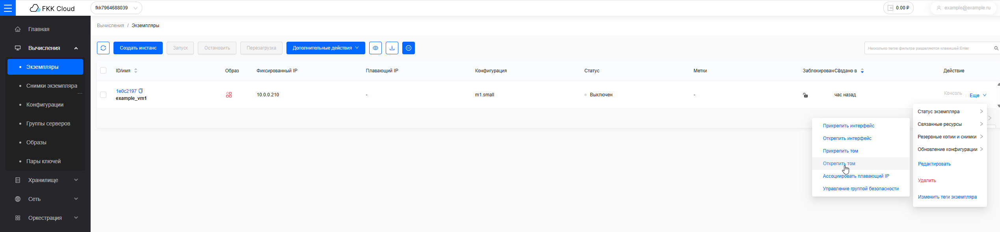

## Восстановление из резервной копии 

### Порядок восстановления из резервной копии диска

1. Перейдите в личный кабинет FKK Cloud.
2. Перейдите в раздел Хранилище: Резервные копии тома.



- Для системного диска

    1. Нажмите на кнопку "Еще" для выбранной резервной копии диска, затем кнопку "Создать том"

        

    2. В открывшемся окне заполните данные для нового диска и подтвердите изменения

        

    3. Запустится процесс создания копии диска из резервной копии 

        

    4. В это же время меняется интерфейс в разделе резервной копии тома 

        

    5. Клон систменого диска из резервной копии не прикреплен к виртуальной машине в отличие от оригинала: 

        

    6. Но на основе этого диска можно создать новую виртуальную машину:

        

    7. Также можно создать и образ: 

        

    8. При создании новой виртуальной машины открывается окно создания инстанса, только на основе существующего диска: 

        

    9. Виртуальная машина создается и доступна в консоли: 

        

        

- Для data диска

   

    Data диски можно открепить от виртуальной машины, поэтому для них доступно восстановление из резеврной копии, без создании копии диска

    

    1. Для начала необходимо открепить диск данных от виртуальной машины: 

        

    2. В открывшемся окне выбираем нужный дата диск и подтверждаем действие: 

        
    
    3. В отличие от системного диска используем кнопку "Восстановить резервную копию"

        

    4. Открывшееся окно предупреждает, что у диска нет прикрепленных инстансов и он может восстановиться, подтверждаем действие: 

        

    5. Инструкция на восстановление получено системой и интерфейс меняется: 

        

    6. Таким образом восстановленный диск можно снова присоединить к виртуальной машине: 

        

        

        

