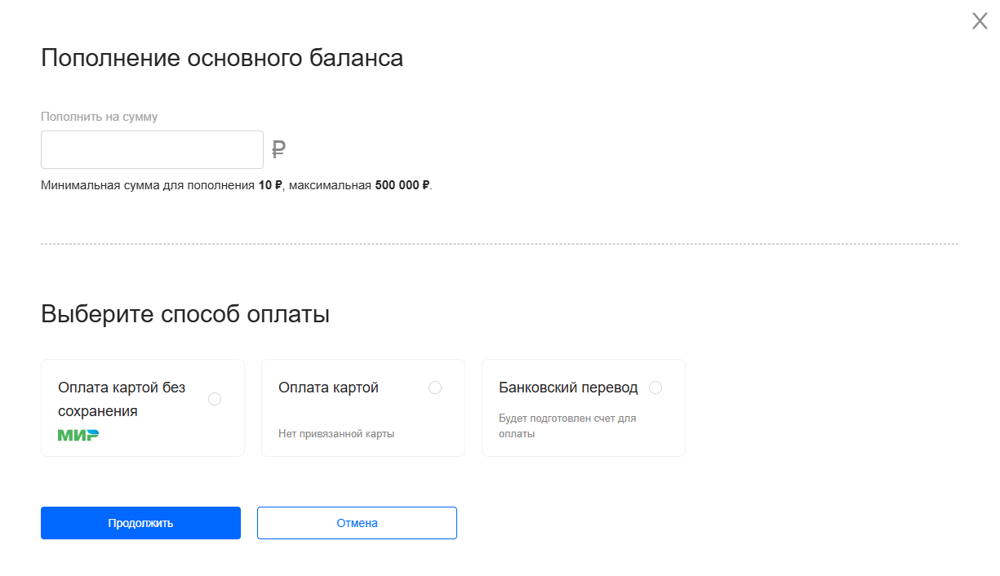

## Банковский перевод



Банковский перевод доступен только для юридического лица



1. Перейдите на страницу **Управление балансом**

2. Нажмите кнопку **+Пополнить** 

3. В открывшемся окне введите сумму пополнения и способ оплаты **Банковский перевод**. 



Минимальная сумма для пополнения 10 ₽, максимальная 500 000 ₽.



4. В это время будет сформирована ссылка для скачивания PDF-счета

5. Нажмите на ссылку или перейдите к оплате счета

6. Оплатите счет в платежной системе

