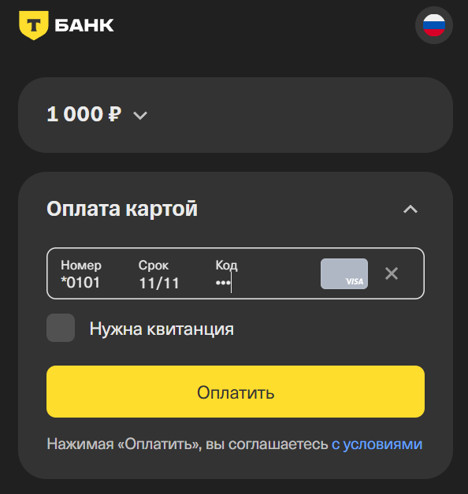

## Оплата картой без сохранения

Позволяет клиенту оплатить покупку банковской картой разово, при этом данные карты (PAN, CVC, срок и т.п.) не сохраняются в системе продавца после проведения оплаты.

Чтобы оплатить: 

1. Перейдите на страницу **Управление балансом**

2. Нажмите кнопку **+Пополнить** 

3. В открывшемся окне введите сумму пополнения и способ оплаты **Оплата картой без сохранения**



Минимальная сумма для пополнения 10 ₽, максимальная 500 000 ₽.



4. Нажмите кнопку **Продолжить** для подтверждения и перехода на страницу оплаты

5. В открывшемся окне **Т-Банк|Платежная страница** введите данные в поля Номер карты, месяц / год и CV-код.

6. После нажатия на кнопку **Оплатить** откроется вкладка **Управление балансом**, где появятся зачисленные средства с карты, что можно проверить в [истории операций](balance-history.md) на той же странице ниже

