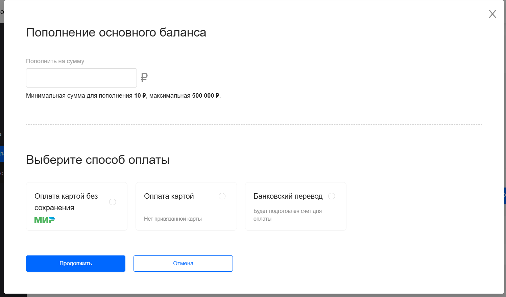

## Оплата привязанной картой

Позволяет пользователю пополнить баланс с ранее привязанной (сохранённой) карты без повторного ввода полных реквизитов карты. 

Чтобы оплатить: 

1. Перейдите на страницу **Управление балансом**

2. Для оплаты требуется заранее [привязать карту](privyazka-bankovscoy-katry.md)

3. Перейдите на страницу **Управление балансом**

2. Нажмите кнопку **+Пополнить** 

3. В открывшемся окне введите сумму пополнения и способ оплаты **Оплата картой**



Минимальная сумма для пополнения 10 ₽, максимальная 500 000 ₽.



4. После нажатия на кнопку **продолжить** откроется вкладка **Управление балансом**, где появятся зачисленные средства с карты, что можно проверить в [истории операций](balance-history.md) на той же странице ниже

