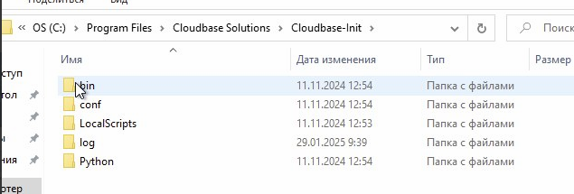
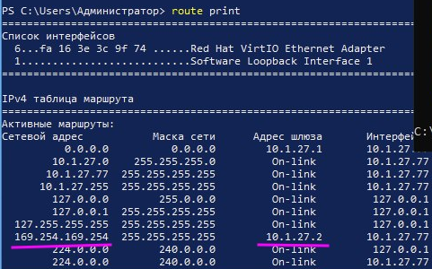
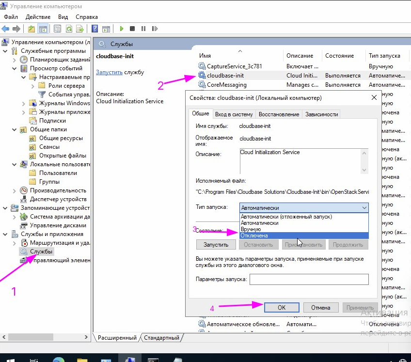
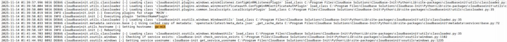
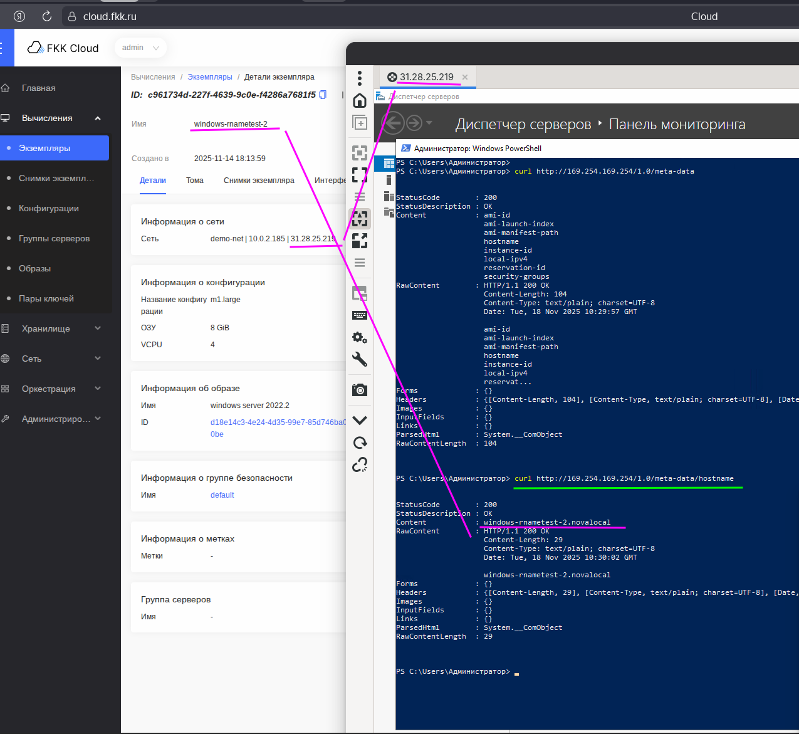
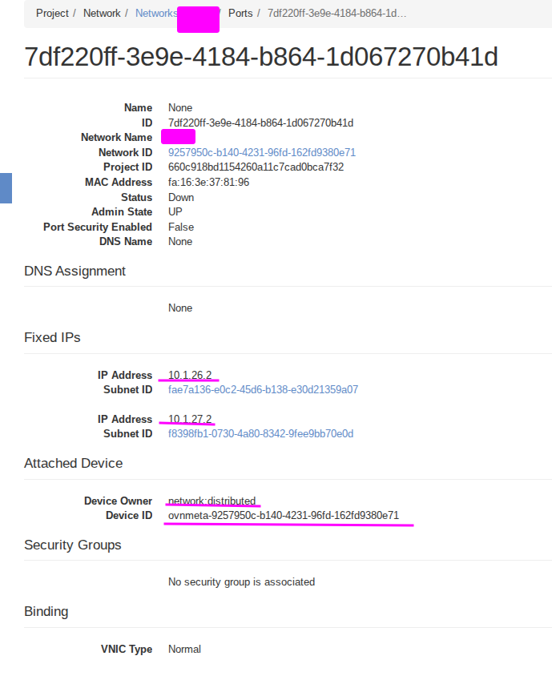

## Cloud-init

### Архитектура cloud-init

- **Серверная часть** — микросервис в OpenStack (интегрирован в Neutron).

- **Клиентская часть** — предустановленный агент в образах ОС (Linux/Windows). В Windows работает как системный сервис под учётной записью .\cloud-init с правами администратора.



**Что хранит серверная часть:**

- имя хоста (hostname);

- список активируемых сервисов;

- пароль по умолчанию;

- SSH‑ключи для конкретного instance;

- иные метаданные экземпляра.

### Как происходит обмен данными

Обмен информацией между серверной и клиентской частями происходит по схеме «запрос‑ответ»:

1. При старте instance клиентская часть отправляет HTTP‑запрос:

```
http://169.254.169.254/openstack/latest/meta_data.json
```

2. Сервер возвращает JSON с параметрами (hostname, SSH‑ключи, пароли и т. д.).

3. Клиентский скрипт cloud‑init:

- сравнивает текущий hostname с полученным;

- при расхождении переименовывает instance;

- применяет прочие настройки;

- перезагружает систему (если требуется).



Примечание: Из‑за последовательного выполнения операций старт Windows‑instance может занимать значительное время.



### Как instance находит адрес 169.254.169.254

Адрес 169.254.169.254 — это link‑local адрес для доступа к метаданным OpenStack. Маршрут к нему передаётся через DHCP‑опцию 121 (Classless Static Route Option).

*Как это работает?*:

При получении DHCP‑лицензии instance автоматически получает статический маршрут к 169.254.169.254 через шлюз метаданных (metadata_agent).

Этот маршрут имеет приоритет и не требует ручной настройки.





Если задать IP вручную (без DHCP), опция 121 не применяется → маршрут к 169.254.169.254 отсутствует.



### Рекомендации по работе с cloud‑init: лучшие практики и устранение типичных проблем

#### Оптимальная практика: отключение cloud‑init после первичной настройки

**Когда применять:**

После завершения первоначальной конфигурации instance, если гарантированно не планируется:

- смена hostname;

- обновление SSH‑ключей;

- изменение сетевых параметров через метаданные OpenStack.

**Эффект:**

- Сокращение времени загрузки Windows‑instance на 30–60 сек.

- Исключение потенциальных конфликтов при повторных запусках.

**Как отключить (Windows):**
```
powershell
# Остановка службы
Stop-Service -Name CloudInit

# Запрет автозапуска
Set-Service -Name CloudInit -StartupType Disabled

```


Перед отключением убедитесь, что все необходимые параметры уже применены.





#### ! Проблема: instance получает имя хоста шлюза

**Симптомы:**

- После перезагрузки hostname instance совпадает с именем сетевого устройства (например, MikroTik).



- Некорректное отображение имени в панели управления облаком.

**Причины:**

1. Ручное назначение IP‑адреса без DHCP → отсутствует маршрут к 169.254.169.254.

2. Изменение маршрута к метаданным через сторонний шлюз.

3. Сбой в обработке ответов от metadata_agent.

**Решение:**

**Шаг 1. Проверка маршрута**

Выполните в PowerShell:

```
powershell
route print | findstr "169.254.169.254"
```

*Ожидаемый результат:*

Шлюз для 169.254.169.254 должен указывать на metadata_agent вашей сети.

**Шаг 2. Проверка метаданных**

**Запросите актуальные параметры:**

powershell

```
curl http://169.254.169.254/openstack/latest/meta_data.json
curl http://169.254.169.254/1.0/meta-date/hostname
```

**Что проверять:**

- Соответствие hostname в ответе ожидаемому имени instance.

- Наличие всех ключевых параметров (SSH‑ключи, сетевые настройки).



**Шаг 3. Восстановление маршрута**

**Если маршрут утерян:**

1. Переведите интерфейс на автоматическое получение IP (DHCP).

2. Перезагрузите instance.

3. Проверьте маршрут командой route print.



**Шаг 4. Отключение cloud‑init (если проблема не устраняется)**

Используйте команды выше. Это полностью исключит влияние сервиса на hostname.

3. Профилактика проблем

**Регулярные проверки:**

Имя хоста:

```
powershell
hostname

```

*Сравните с ожидаемым значением.*

**Доступность метаданных:**

```
powershell
curl -s -o NUL -w "%{http_code}" http://169.254.169.254/openstack/latest/meta_data.json

```

Ожидаемый код: 200.

**Цепочка маршрутов:**

```
powershell
tracert 169.254.169.254

```

Убедитесь, что первый хоп — это metadata_agent.

**Рекомендации:**



- Избегайте ручного назначения IP без крайней необходимости.
- При смене сетевых настроек всегда проверяйте маршрут к 169.254.169.254.
- После критических обновлений ОС перезапускайте instance и проверяйте hostname.



4. Дополнительные инструменты диагностики

**Для Linux‑instance:**

```
bash
# Проверка маршрута
ip route show | grep 169.254.169.254

```

**Тест доступности метаданных**

curl -v http://169.254.169.254/openstack/latest/meta_data.json

**Просмотр логов cloud‑init**

```
journalctl -u cloud-init -b

```

**Для Windows‑instance:**

Просмотр логов:
C:\ProgramData\cloud-init\log\cloud-init.log

**Проверка статуса службы:**

```
powershell
Get-Service -Name CloudInit | Select Status, StartType

```


