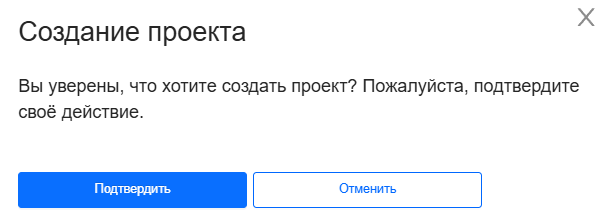

## Создание нового проекта

Чтобы создать новый проект: 

1. Зайдите в ЛК FKK Cloud

2. Откройте выпадающее меню проектов и нажмите кнопку **Создать проект**

3. В появившемся окне подтвердите создание проекта

Новый проект создается с правами owner проекта



В проекте может быть только один владелец - создатель проекта, и эту роль нельзя назначить или пригласить.

