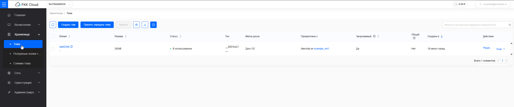
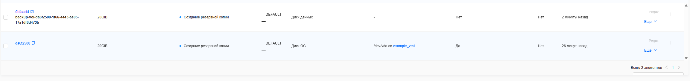
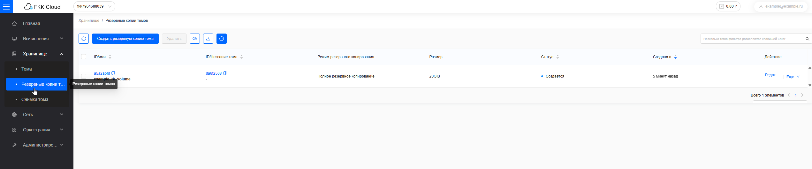

## Создание резервной копии вручную

Помимо [автоматического резервного копирования](plan-of-rk.md) в личном кабинете FKK Cloud можно создавать резервные копии вручную:

Используйте ручной режим для создания резервных копий перед операциями, связанными с риском утраты данных.

### Порядок создания резервной копии диска

1. Перейдите в личный кабинет FKK Cloud.
2. Перейдите в раздел Хранилище: Тома.

3. Нажмите кнопку "Еще" в разделе действий для выбранного диска, после чего в разделе "защиты данных" выберите "Создать резервную копию"

 

4. В открывшемся окне "Создания резервной копии тома" заполните обязательные данные: имя резервной копии тома и нажмите кнопку "Подтвердить"



Создание резервной копии может занять длительное время (до 30 минут). Все зависит от размера диска. 



* Таким образом происходит создание резервной копии: 

* Когда закончиться создание резервной копии, интерфейс обновиться таким образом: 



Чтобы не обновлять страницу вручную, можно воспользоваться кнопкой "Автоматического обновления страницы":



* Резервная копия будет находится в разделе "Резервные копии томов", пока она в состоянии "Создается": 

* После создания ее статус обновиться: 

