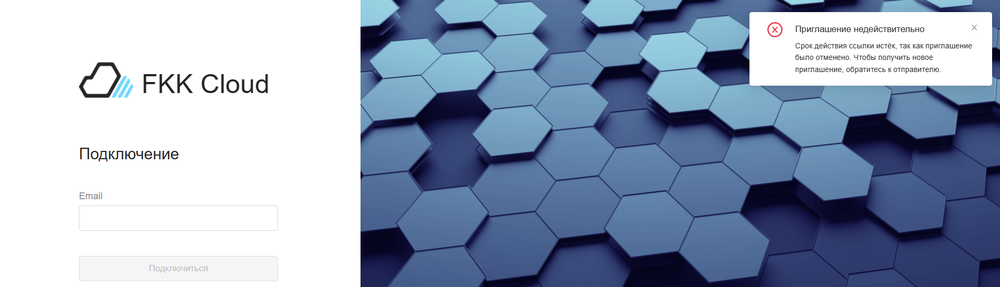
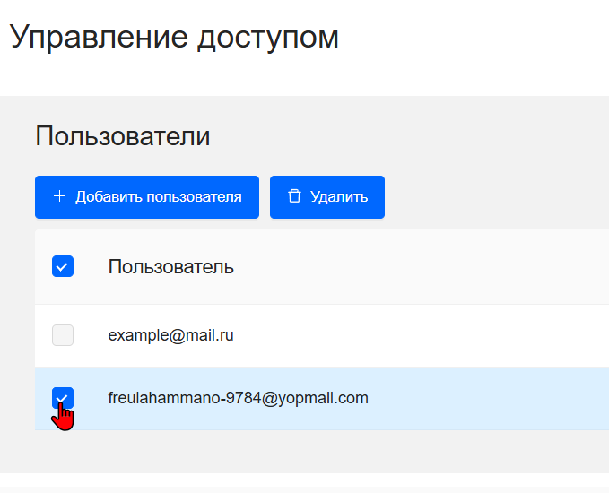
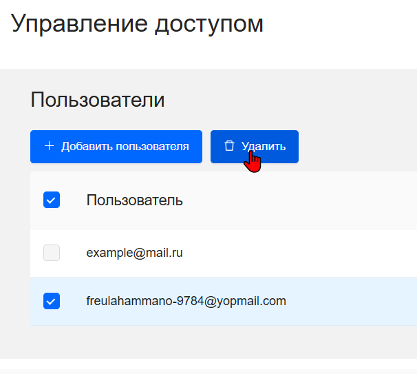
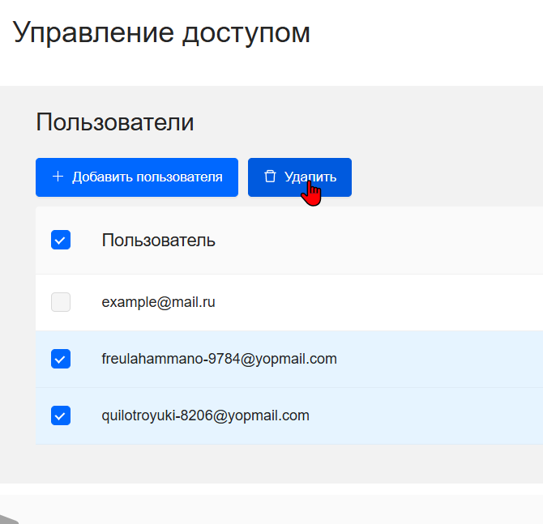
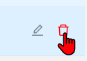
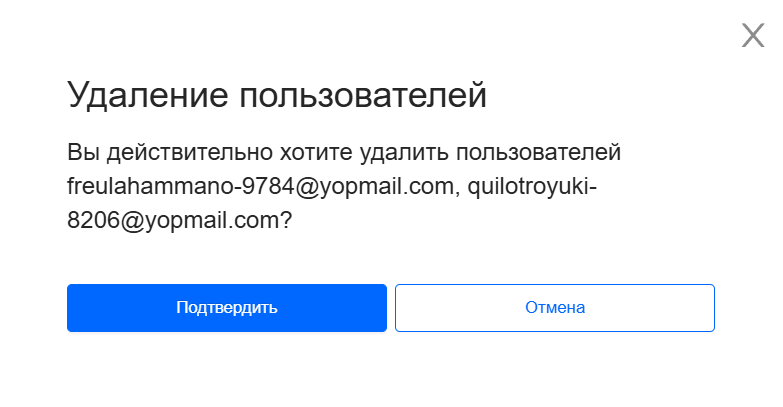

## Удаление пользователя

Удаление участника проекта возможно при статусах:

1. Приглашение не принято. Если пользователь перейдет по ссылке приглашению, то высветиться уведомление в правом верхнем углу

2. Приглашение принято или статус **Да**. Если пользователь зайдет в личный кабинет, то проект не будет отображаться в его списке проектов

### Реализация

Чтобы удалить пользователя из проекта: 

1. Перейдите на страницу **Управление доступом** 

2. Выберите пользоваетля, которого хотите удалить из проекта 

3. Нажмите удалить



Чтобы удалить сразу несколько пользователей, выделите их и нажмите удалить

Также для одичного удаления пользователя можно воспользоваться инструментами 



4. После нажатия на кнопку удаления появиться предупреждение об удалении пользователя(ей) 

5. Нажмите кнопку **Подтвердить** и пользователей удалиться из проекта



Удаление пользователя возможно только для владельца проекта

