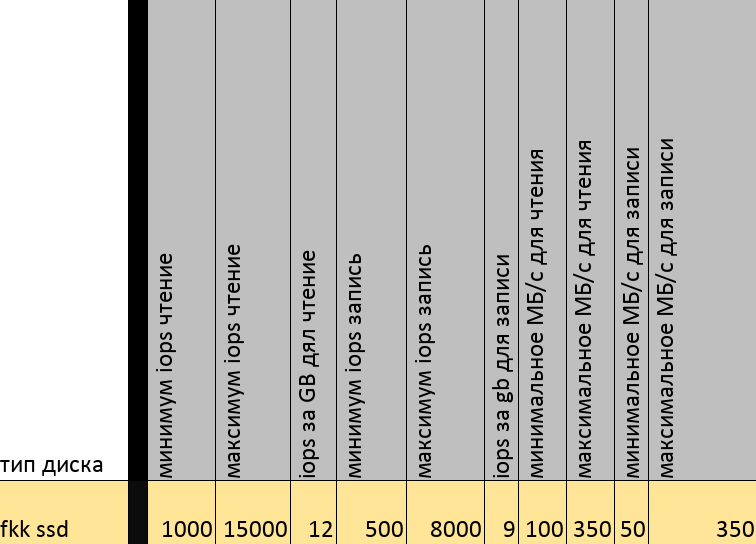

## Квоты и лимиты

### Диски (QoS)

    

**QoS** (качество обслуживания) для дисков — набор гарантированных и максимальных ограничений по операциям ввода‑вывода и пропускной способности (IOPS и MB/s), применяемых к дисковым томам.

- Минимум IOPS для чтения: гарантированное минимальное число операций чтения в секунду, которое будет обеспечено.

- Максимум IOPS для чтения: верхний предел операций чтения в секунду (троттлинг).

- IOPS за 1 GB для чтения: число IOPS на гигабайт объёма; используется для масштабирования гарантии с размером тома.

- Минимум IOPS для записи: гарантированное минимальное число операций записи в секунду.

- Максимум IOPS для записи: верхний предел операций записи в секунду.

- IOPS за 1 GB для записи: число IOPS на гигабайт для записей.

- Минимальная MB/s для чтения: гарантированная минимальная пропускная способность чтения (мегабайт в секунду).

- Максимальная MB/s для чтения: верхняя граница пропускной способности чтения.

- Минимальная MB/s для записи: гарантированная минимальная пропускная способность записи.

- Максимальная MB/s для записи: верхняя граница пропускной способности записи.
