## Основная информация

Основная информация отображает персональные данные  пользователя (ФИО, контакты) и предоставляет интерфейс для их редактирования:

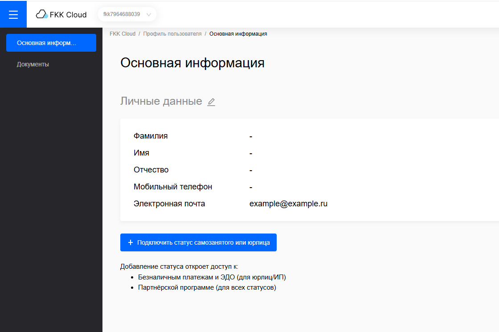

Клиент может отредактировать свои данные, воспользовавшись иконкой редактирования:

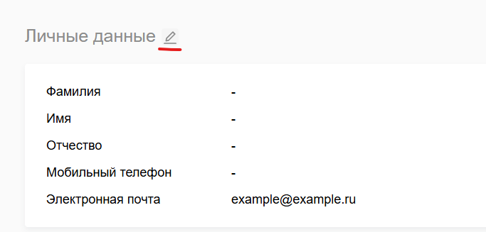

### Оформление аккаунта юрлица

Ниже расположена кнопка “Подключить статус самозанятого или юрлица”, которая предоставляет клиенту возможность зарегистрироваться на платформе как самозанятый или юрлицо и открыть доступ к безналичным платежам, ЭДО (для юрлиц/ИП) и партнерской программе.

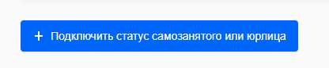

Клиент вводит ключевые данные организации, такие как ИНН, выбирает организацию из предложенного списка и подтверждает реквизиты. Дополнительно выбирается провайдер ЭДО для получения расчетных документов.

*Клиент выбирает тип деятельности "Юридическое лицо (ООО)". Система активирует поля, специфичные для ООО (ИНН и др.).*

*Клиент просматривает все введённые и подгруженные реквизиты организации, включая тип деятельности, наименование, ИНН, КПП, ОГРН, юридический адрес, а также выбранного провайдера ЭДО.*

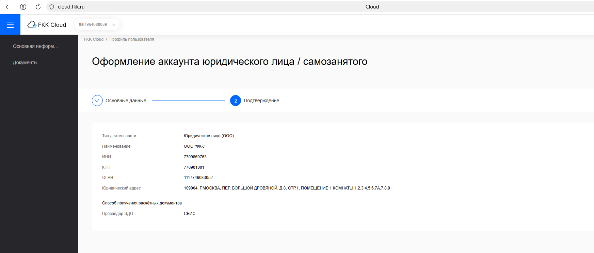

Данные организации сохраняются в ЛК клиента

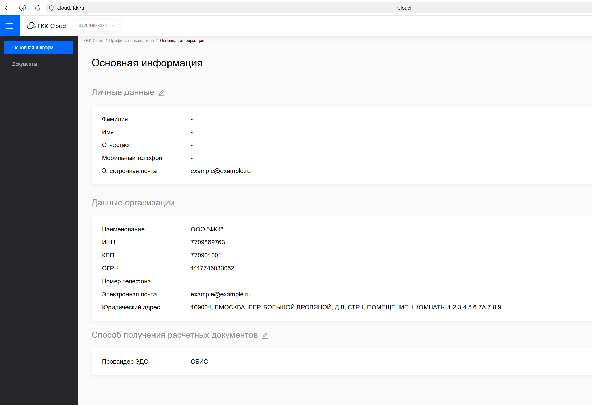

### Оформление аккаунта ИП

*Клиент выбирает тип деятельности "Индивидуальный предприниматель (ИП)". Система активирует поля, специфичные для ИП (ИНН и др.).*

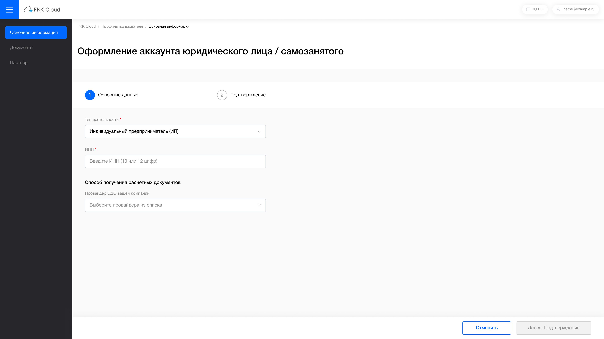

*Клиент проверяет данные перед подтверждением.*

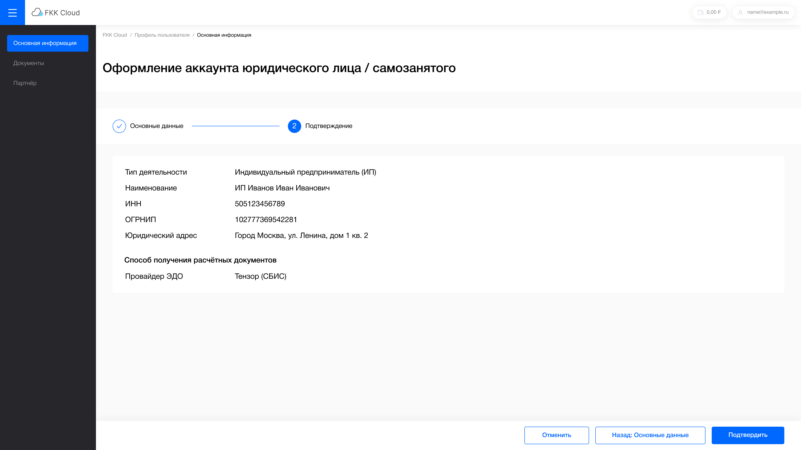

*Обзор и подтверждение введённых данных*

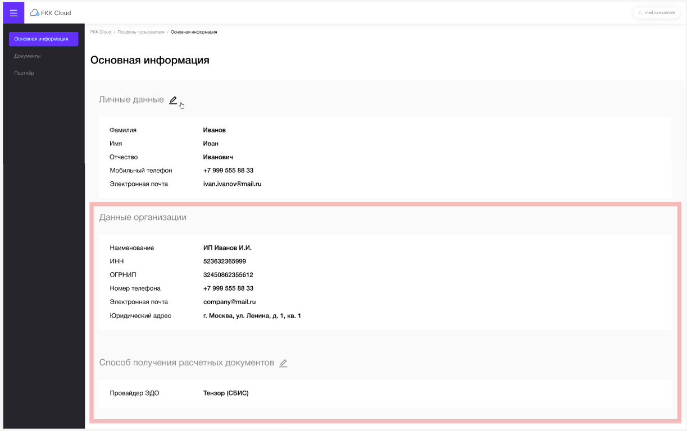

### Оформление аккаунта самозанятого

*Клиент заполняет обязательные поля: ФИО, ИНН и паспортные данные. Кнопка перехода к следующему этапу активируется только после успешной валидации всех обязательных полей.*

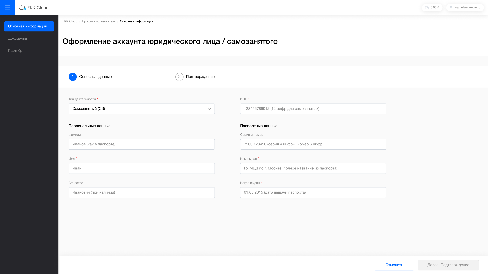

*Клиент может проверить правильность введённых данных перед подтверждением.*

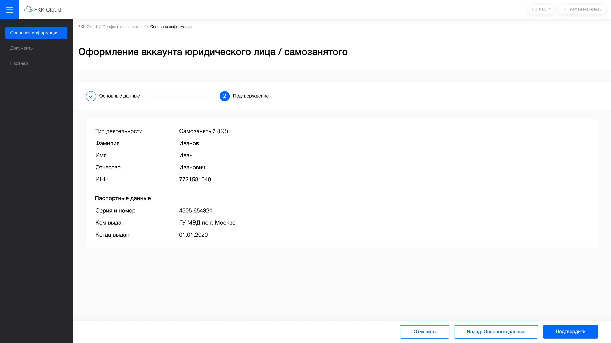

*Обзор и подтверждение введённых данных*

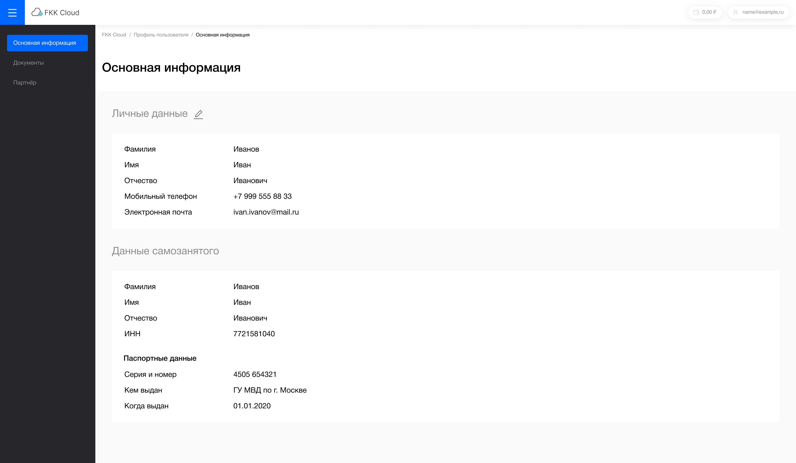