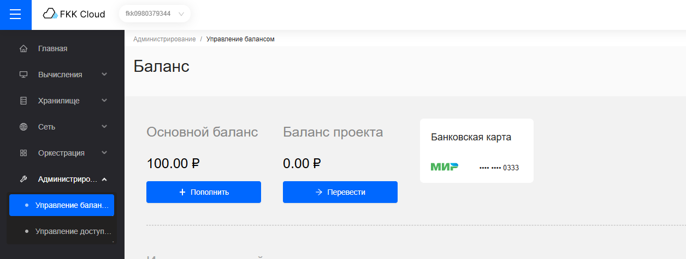
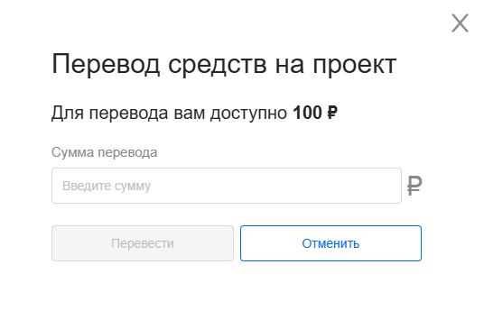
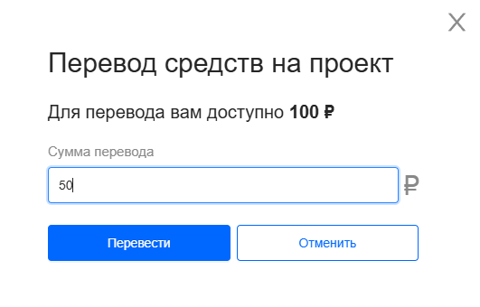
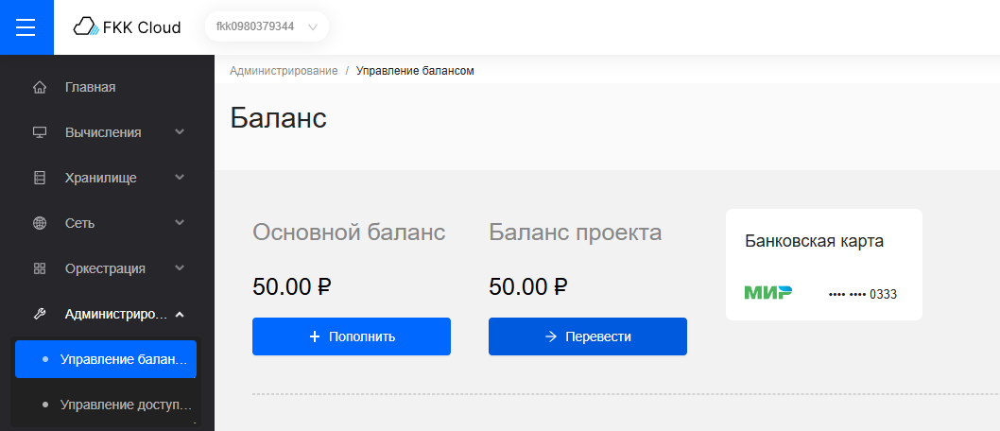

## Перевод на баланс проекта

Чтобы перевести средства на баланс проекта необходимо: 

1. Перейти в **Управление балансом**

2. Нажать кнопку **+ Перевести** и перейти на форму подтвреждения

3. Введите сумму доступную для перевода

4. Подтвердите перевод нажатием кнопки **Перевести** и средства на проекте пополнятся благодаря переводу с основного счета

