## План резервного копирования

Доступность к деяствиям в разделе планов резервного копирования описаны [здесь](matrica_dostupa.md)
* Поддерживается создание только полных бэкапов
* Название полной резервной копии - backup_plan_name instance_id volume_id yyyymmdd_hhmm nnnnnnnn
### Создать план

Создание плана автоматического резервного копирования для инстансов обеспечивает регулярное сохранение данных без ручного вмешательства.



Кнопка создания плана доступна только если оба условия соблюдены:

1. Клиент является owner/member проекта
2. В проекте существует хотя бы 1 инстанс в статусе отличный от "Ошибка" 



Пошаговая инструкция: 

1. Расскрыть вкладку **Резервное копирование** и перейти в раздел **Автоматическое**

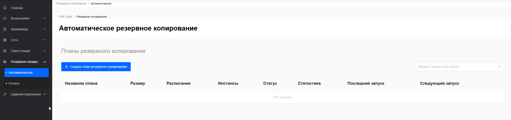

2. Нажать кнопку **✚ Создать план резервного копирования** 

3. В открывшейся форме заполнить обязательные поля и нажать кнопку **Далее: Подтверждение**

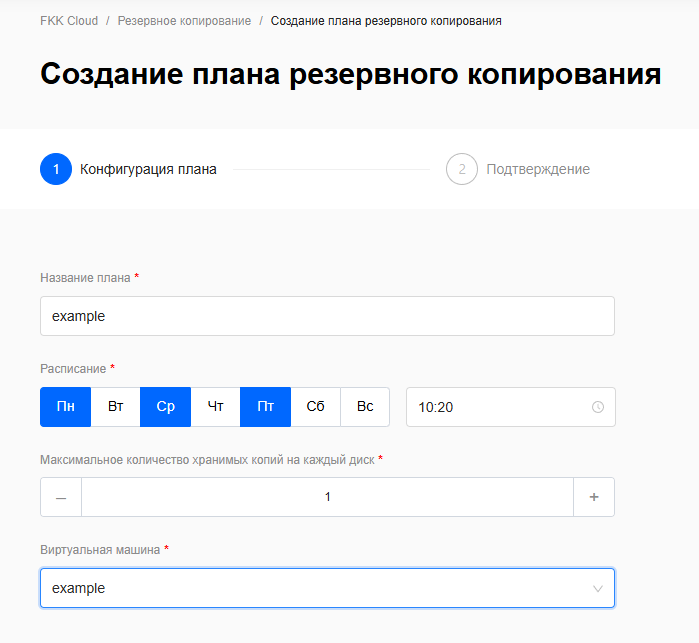



Обязательные поля для заполнения в создании плана резервного копирования: 

1. **Название плана** (минимум 3 символа). Должно быть уникально среди всех проектов пользователя.

2. **Расписание**. Дни недели (пн-вс) и время (формат UTC). Будьте внимательны при выборе времени!

3. **Максимальное количество хранимых копий на каждый диск** (1-100). Как только лимит резервных копий будет исчерпан, при следующем запуске плана будут создаваться новые и затем удаляться старые резервные копии.

4. **Виртуальная машина**. Можно выбрать любое количество виртуальных машин (Подходят машины в статусы "Активный", "Архивирован", "Выключен")



4. Проверить введенные данные на странице **подтверждения** и нажать кнопку **Создать план**. Чтобы вернуться к конфигурации плана используйте кнопку **Назад: Конфигурация плана** или знак ✏️

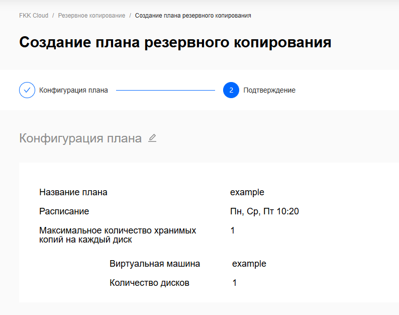

5. Планы будут отражаться на странице **FKK Cloud / Резервное копирование**

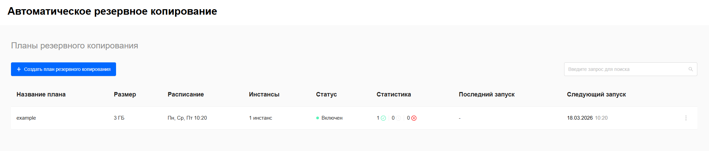



Столбец "Статистика" - отображает сводку по всем резервным копиям плана.

0✅ - количество копий со статусом "Доступна" (Available) (готовые к восстановлению)

0❌ - количество копий со статусами "Ошибка" (Error), "Ошибка удаления" (Error Deleting) (критические проблемы)

0⚪ - количество копий со статусами "Создание" (Creating), "Восстановление" (Restoring), "Обновление" (Updating) (активные процессы)



### Редактировать план

Редактирование плана автоматического резервного копирования позволяет изменять параметры существующих планов,
чтобы адаптировать настройки под изменяющиеся требования.



Кнопка редактирования плана доступна только если оба условия соблюдены:

1. Клиент является owner/member проекта
2. В проекте существует хотя бы 1 план резервного копирования 



Пошаговая инструкция: 

1. Открыть дополнительное меню (⋮) у плана и выбрать действие **Редактировать план**

2. В открывшемся окне конфигурации плана изменить данные под новые требования и перейти к **подтверждению** и **сохранению плана**

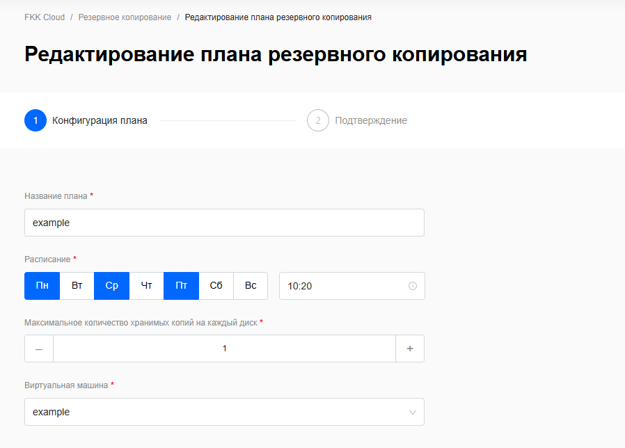
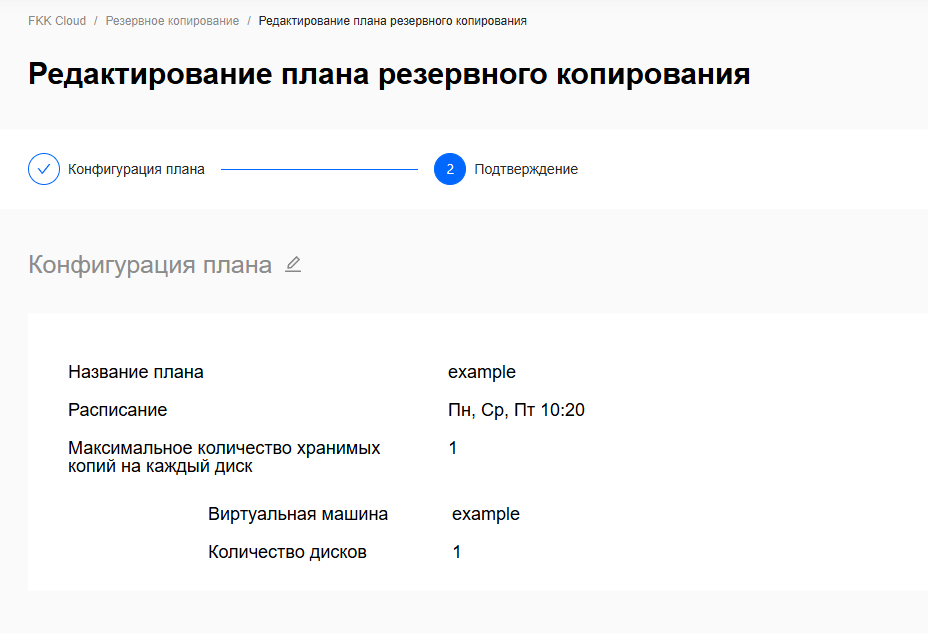

### Удалить план

Удаление плана позволяет  удалять ненужные или устаревшие планы резервного копирования,
чтобы прекратить списание ресурсов и затрат, связанных с этим планом.



Кнопка удаления плана доступна только если все условия соблюдены:

1. Клиент является owner/member проекта
2. В проекте существует хотя бы 1 план резервного копирования 
3. План не имеет резервных копий



Пошаговая инструкция: 

1. Открыть дополнительное меню (⋮) у плана и выбрать действие **Удалить**

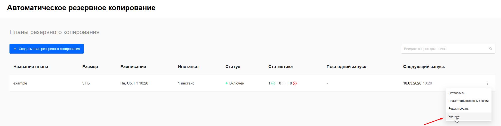

2. В открывшемся окне **подтвердить** удаление плана

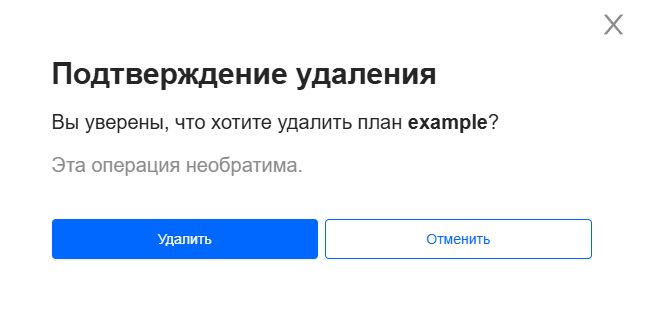

3. Если после нажатия кнопки **Удалить** в подтверждении удаления высветилось следующее окно, то необходимо [удалить](reservnie_kopii.md) связаные резервные копии с планом 

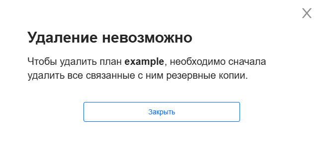



Связь между резервными копиями и планами резервного копирования реализована через сопоставление названий. Если пользователь вручную создаёт резервную копию и присваивает ей название, совпадающее с названием существующего плана резервного копирования, данная копия автоматически добавляется в список резервных копий, относящихся к этому плану. Таким образом, название выступает ключевым идентификатором при связывании копий с планами.



### Остановить/включить план

Возможность включать/отключать ранее отключенные/выключенные планы резервного копирования,
чтобы возобновить/остановить автоматическое создание резервных копий.



Кнопка включения/отключения плана доступна только если оба условия соблюдены:

1. Клиент является owner/member проекта
2. В проекте существует хотя бы 1 план резервного копирования 



Пошаговая инструкция: 

1. Открыть дополнительное меню (⋮) у плана и выбрать действие **Включить/отключить**

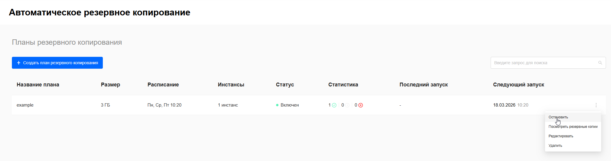
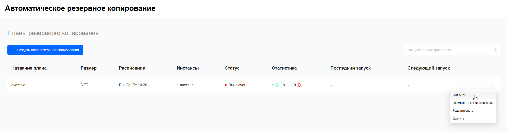

2. Дождаться выполнения запроса и статус плана изменится

