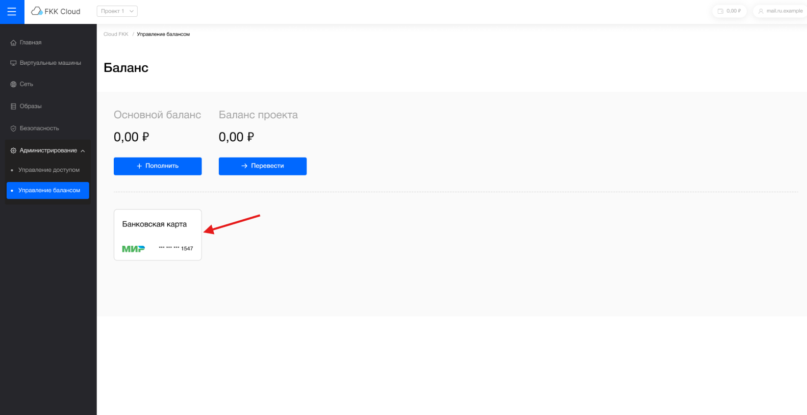
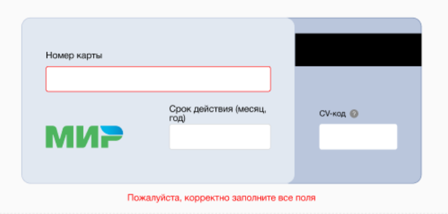

# Привязка банковской карты

## Привязать карту

Карта может быть привязана к проекту самостоятельно в любое время.

Чтобы привязать карту:

1. Перейдите в личный кабинет [FKK Cloud](https://cloud.fkk.ru "cloud.fkk")

2. Откройте расскрывающуюся вкладку "Администрирования" и перейдите по странице "Управление балансом"

3. В открывшемся окне выбрать значок банковской карты 

4. Ввести данные карты

5. Нажать кнопку "Сохранить"

6. Если карта привязана, на странице "Управление балансом" отображаются ее последние 4 цифры

## Отвязать карту

Отвязать банковскую карту можно через [службу поддержки](mailto:support@fkk.team)

_**Примерный процесс, который осуществляется через переписку между клиентом и службой поддержки по электронной почте:**_

1. Инициирование запроса:

Клиент обращается в службу поддержки через доступные каналы через электронная почту.

Клиент сообщает о своем намерении отвязать банковскую карту.

2. Подтверждение личности:

Служба поддержки запрашивает у клиента информацию для подтверждения его личности (например, имя, номер аккаунта, последние транзакции и т.д.).

Клиент предоставляет необходимую информацию.

3. Проверка статуса карты:

Служба поддержки проверяет статус карты в системе (активна ли она, есть ли активные подписки и т.д.).

Если карта используется для подписок или регулярных платежей, служба уведомляет клиента об этом.

4. Подтверждение отвязки:

Служба поддержки запрашивает подтверждение от клиента на отвязку карты.

Клиент подтверждает свое желание отвязать карту.

5. Отвязка карты:

Служба поддержки выполняет процесс отвязки карты в системе.

Если необходимо, служба поддерживает клиента в процессе отмены подписок или переноса платежных данных на другую карту.

6. Уведомление клиента:

Клиент получает уведомление о том, что карта успешно отвязана.