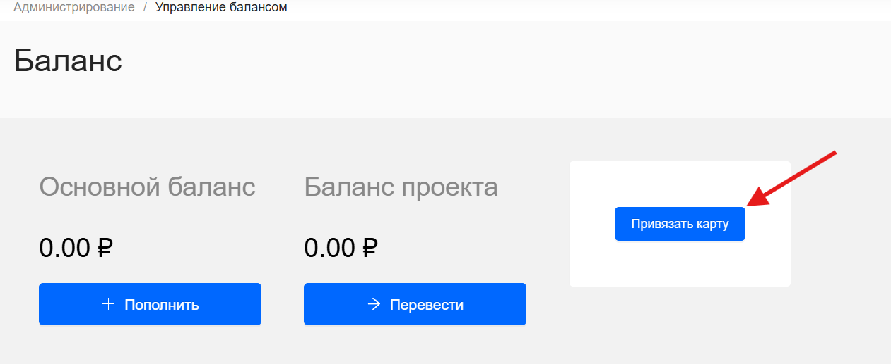

## Привязка банковской карты

Карта может быть привязана к проекту самостоятельно в любое время.

После привязки карты в проекте появляется доступ к оплате услуг FKK Cloud. 



Юридическим лицам рекомендуется оплачивать сервисы при помощи банковских переводов. Платежи с карт не учитываются в отчетных документах.



Чтобы привязать карту:

1. Перейдите в личный кабинет [FKK Cloud](https://cloud.fkk.ru "cloud.fkk")

2. Нажмите на расскрывающуюся вкладку **Администрирование** и перейдите на страницу **Управление балансом**

3. Нажмите кнопку **Привязать карту** 

4. В открывшейся вкладке **Т-Банк|Платежная страница** введите данные в поля Номер карты, месяц / год и CV-код.

5. Нажмите кнопку "Оплатить". После чего автоматически откроется страница **Управление балансом**, где появится привязанная банковская карта.

С карты будет списана сумма в размере 10 рублей, которая будет зачислена на основной счет.



Полный список способов оплаты в статье [Способы оплаты](by-card-bez.md).



6. Если карта привязана, на странице "Управление балансом" отображаются ее последние 4 цифры

## Отвязать карту

Чтобы отвязать карту, обратитесь в [службу поддержки](mailto:support@fkk.team) и предоставьте информацию:

* идентификатор (PID) проекта;
* последние 4 цифры номера привязанной карты.