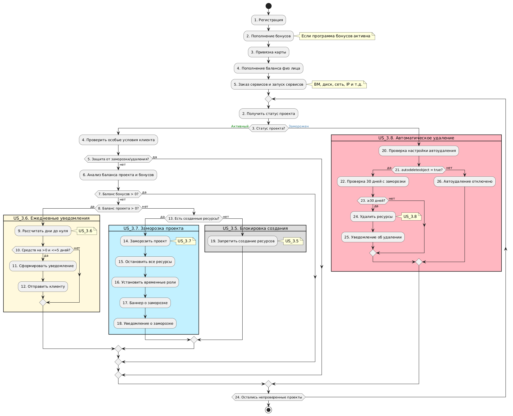

## Маршрутизация средств

**Приоритет использования средств для использования баланса проекта:**

1. Бонусы

2. Физическое лицо

3. Юридическое лицо

Пример:

У клиента бонусов 100, на балансе проекта  юрика - 100 рублей, физик 50 рублей. Как потратятся 225 рублей? Вначале 100 рублей бонусов, потом 50 рублей физика, потом, 75 рублей юрика.

*В отчет УПД попадет 75 рублей юрика.*

**Приоритет использования средств при перечислении средств с основного баланса на баланс проекта:**

1. Физическое лицо

2. Юридическая лицо

Пример:

На основном счету юрика - 100, на основном счету физика - 200. Клиент перечисляет с основного счета 250 рублей, как возьмутся деньги с основного баланса? Возьмется 200 рублей физика и 50 рублей юрика.

*В отчет УПД попадет 50 рублей юрика.*

