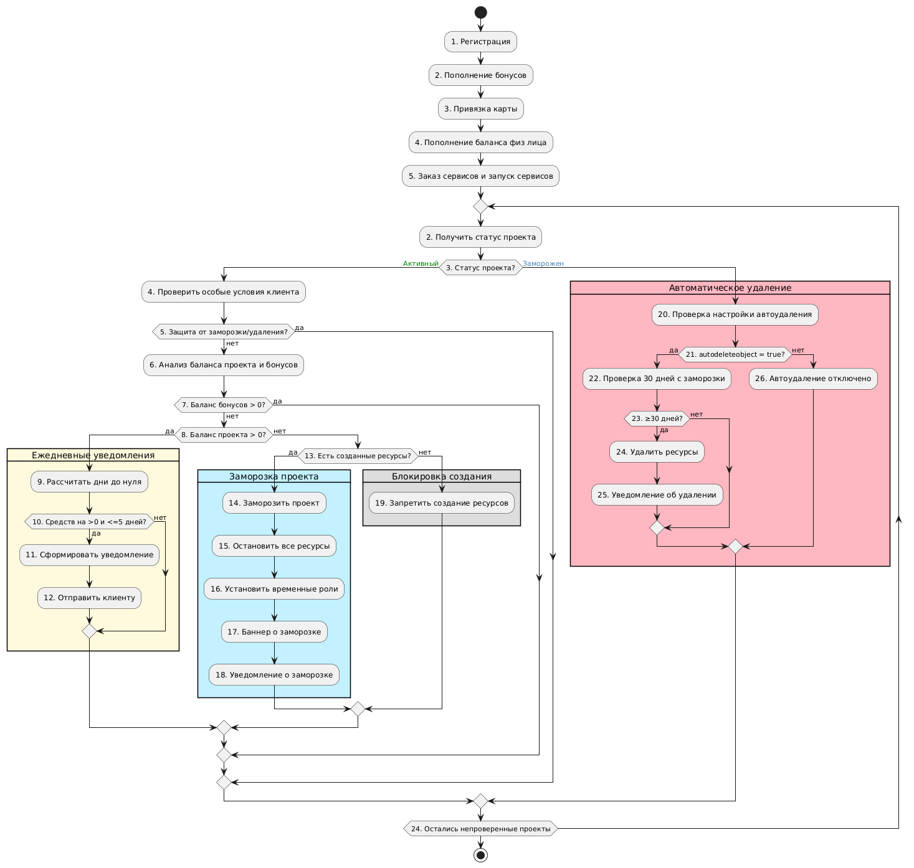

*Схема 1 - Автоматизация управления статусом проекта по балансу*

## Маршрутизация средств

**Приоритет использования средств для использования баланса проекта:**

1. Бонусы

2. Физическое лицо

3. Юридическое лицо

**Пример:**

Клиент располагает следующими средствами:

1. 100 бонусных рублей;

2. 100 рублей на балансе проекта юридического лица;

3. 50 рублей на балансе проекта физического лица.

*При списании суммы 225 рублей средства будут использованы в следующем порядке:*

1. Сначала списываются 100 бонусных рублей.

2. Затем списываются 50 рублей с баланса проекта физического лица.

3. Оставшаяся часть суммы — 75 рублей — списывается с баланса проекта юридического лица.

**В отчёт по УПД будет включена сумма 75 рублей, списанная с баланса проекта юридического лица.**

**Приоритет использования средств при перечислении средств с основного баланса на баланс проекта:**

1. Физическое лицо

2. Юридическая лицо

**Пример:**

Клиент имеет следующие средства на основных счетах:

на основном счёте юридического лица  — 100 руб.;

на основном счёте физического лица  — 200 руб.

*При осуществлении перечисления на сумму 250 руб. списание производится в следующем порядке:*

1. В первую очередь списывается полная сумма, доступная на счёте физического лица, — 200 руб.

2. Оставшаяся часть суммы (50 руб.) списывается с основного счёта юридического лица.

**В отчёт по УПД включается сумма 50 руб., списанная с основного счёта юридического лица.**

| Параметр | Пример | Примечание |
|---|---|---|
| **Основные характеристики** | |
| Flavor | m1.tiny | Конфигурация ВМ |
| vCPU count | 1 | Виртуальные процессоры |
| RAM (GB) | 1 | Оперативная память |
| Disk (GB) | 1 | Дисковое пространство |
| **Сумма за месяц** | |
| Цена vCPU | 100 |                 
| Цена RAM (GB) | 100 |
| Цена Disk (GB) | 8 |
| **Сумма за день** | |
| Сумма vCPU | 3.3333333 |
| Сумма RAM | 3.3333333 |
| Сумма Disk | 0.2666667 |
| **Сумма за час** | |
| Сумма vCPU | 0.1388889 |
| Сумма RAM | 0.1388889 |
| Сумма Disk | 0.0111111 |
| **Сумма за минуту** | |
| Сумма vCPU | 0.0023148 |
| Сумма RAM | 0.0023148 |
| Сумма Disk | 0.0001852 |

*Таблица 1 - Пример расчета биллинга*