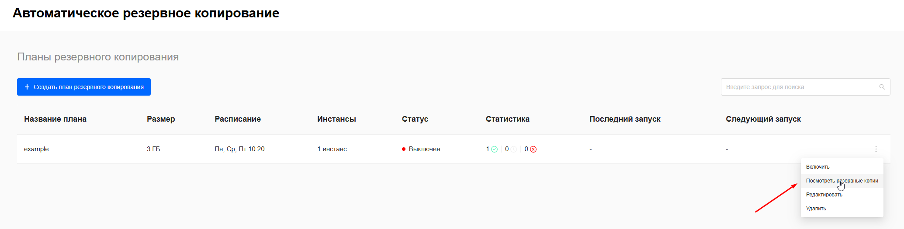
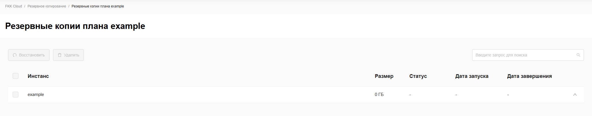
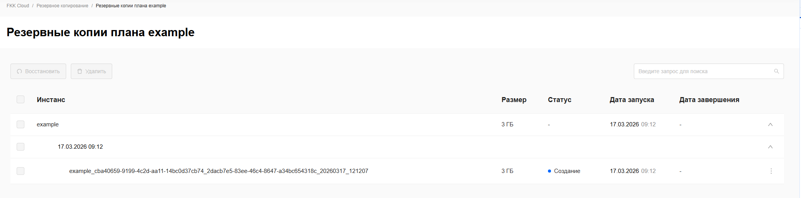
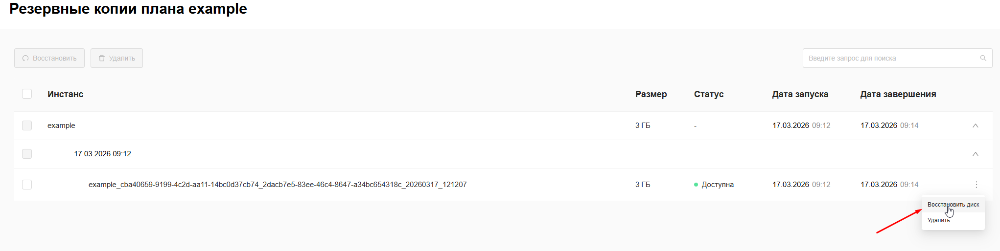
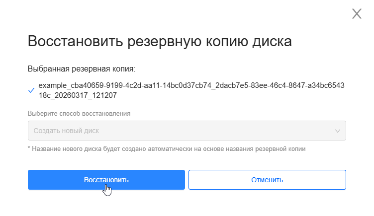
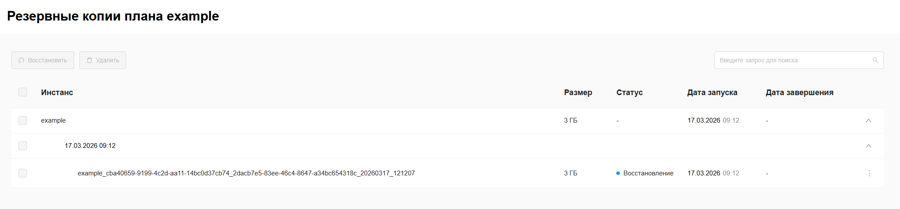
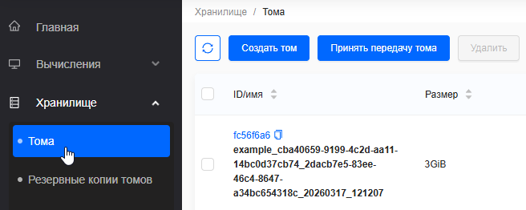
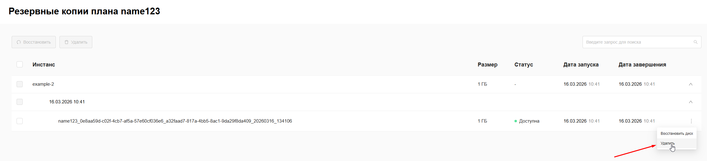

## Резервные копии

Доступность к деяствиям в разделе резервных копий плана описаны [здесь](matrica_dostupa.md)

### Посмотреть резервные копии

Возможность просматривать список всех резервных копий конкретного плана,
чтобы управлять точками восстановления и контролировать использование хранилища.

Пошаговая инструкция: 

1. Открыть дополнительное меню (⋮) у плана и выбрать действие **Посмотреть резервные копии**

2. В открывшемся окне можно ознакомится с существующими резервными копиями, если их нет, то список будет пустой

### Восстановить резервную копию

Возможность восстанавливать диски (volumes) из автоматических резервных копий,
чтобы быстро восстанавливать данные после сбоев.



Кнопка создания плана доступна только если все условия соблюдены:

1. Клиент является owner/member проекта
2. В плане существует хотя бы 1 резервная копия
3. Выбранная резервная копия имеет статус **Доступна** («Available»).



Пошаговая инструкция: 

1. Открыть дополнительное меню (⋮) у плана и выбрать действие **Посмотреть резервные копии**

2. Открыть дополнительное меню (⋮) резервной копии и выбрать действие **Восстановить диск**

3. **Подтвердить** восстановление диска *созданием нового диска*

4. Копия примет статус **восстановления** и появится в разделе **Хранилища > Тома**

### Удалить резервную копию

Возможность удалять ненужные резервные копии,
чтобы освобождать место в хранилище.



Кнопка создания плана доступна только если все условия соблюдены:

1. Клиент является owner/member проекта
2. В плане существует хотя бы 1 резервная копия
3. Выбранная резервная копия имеет статус **Доступна** («Available»).



Пошаговая инструкция: 

1. Открыть дополнительное меню (⋮) у плана и выбрать действие **Посмотреть резервные копии**

2. Открыть дополнительное меню (⋮) резервной копии и выбрать действие **Удалить**

