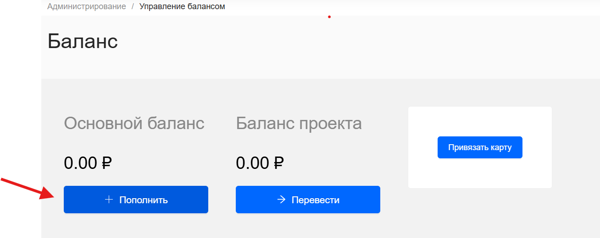

## Способы оплаты

Есть несколько способов пополнить баланс проекта. Внесенные средства поступают на основной счет проекта, откуда потом расходуются на оплату сервисов.

Список доступных способов оплаты отображается на странице **Управление балансом** при нажатии на кнопку **+ Пополнить**.

Способы оплаты: 

1. [Оплата банковской картой без сохранения](by-card-bez.md)

2. [Оплата привязанной картой](by-card-with.md)

3. [Банковский перевод](bank-perevod.md)