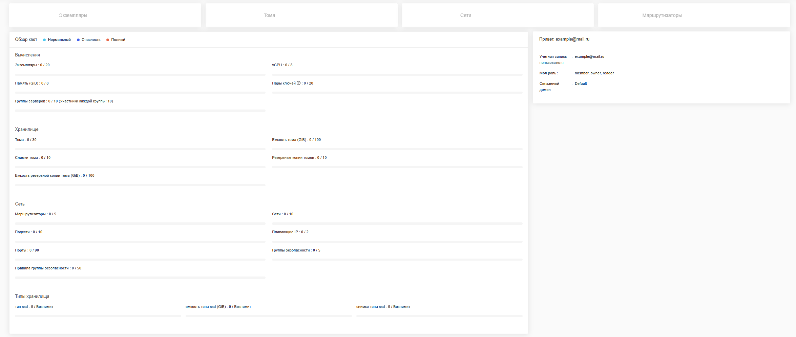

##  Панель управления

### Вкладка "Главная"

Вкладка "Главная" показывает информацию о пользователе и детали квоты по **вычислениям**, **хранилищу**, **сети** и т.д. Она предоставляет кнопку для быстрого перехода к страницам "Экземпляры", "Объемы", "Сети" и "Маршрутизаторы"

### Вкладка "Вычисления"

- **Экземпляры**: Просмотр, запуск, удаление, создание снимка, подключение или отключение интерфейса, подключение или отключение томов, ассоциация плавающего IP, управление группой безопасности, остановка, приостановка, блокировка, временное отключение, перезагрузка или мягкая перезагрузка экземпляров, изменение тегов экземпляров или подключение к ним через VNC.

- **Снимки экземпляров**: Просмотр, редактирование, удаление снимков экземпляров, запуск экземпляров или создание томов из них.

- **Конфигурации**: Просмотр конфигураций.

- **Группы серверов**: Просмотр, создание или удаление групп серверов.

- **Образы**: Просмотр, создание, редактирование, удаление образов, запуск экземпляров или создание томов из них.

- **Пары ключей**: Просмотр, создание, редактирование, импорт и удаление ключевых пар.

### Вкладка "Хранилище"

- **Тома**: Просмотр, создание, редактирование и удаление томов. Создание снимка тома, создание резервной копии тома, клонирование тома, увеличение тома или изменение типа тома, подключение или отключение их к экземпляру.

- **Резервные копии томов**: Просмотр, создание, редактирование и удаление резервных копий томов. Также создание томов из них и восстановление резервной копии.

- **Снимки тома**: Просмотр, создание, редактирование, удаление снимков томов. И создание томов из них.

### Вкладка "Сеть"

- **Сети**: Просмотр, создание, редактирование и удаление сетей.

- **Порты**: Просмотр, создание, редактирование, удаление портов и управление группой безопасности для портов.

- **Маршрутизаторы**: Просмотр, создание, редактирование, удаление и управление маршрутизаторами.

- **Плавающие IP**: Выделение IP-адресов или их освобождение.

- **Топология**: Просмотр сетевой топологии.

- **Группы безопасности**: Просмотр, создание, редактирование и удаление групп безопасности и правил групп безопасности.

