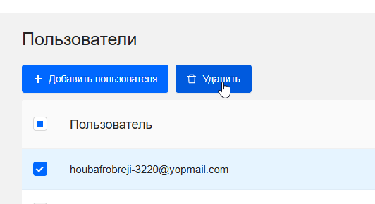
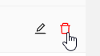

## Управление пользователями

Управление пользователями предоставляет централизованный инструмент для управления доступом к вашему проекту в FKK Cloud. Здесь вы можете видеть всех участников проекта, их роли и приглашать новых пользователей. Также есть доступ к редактированию роли и удалению одного или нескольких пользователей сразу.

[Просмотр пользователей](prosmotr-users.md)

[Добавление пользователя](add-users.md#anchor)

[Редактирование роли пользователя](update-role.md#anchor)

[Удаление пользователя](delete-user.md#anchor)

На вкладке Управление доступом представлены следующие элементы:

Кнопки действий: 

1. ✚ Добавить пользователя

2. Неактивная кнопка 🗑️ Удалить



Кнопка неактивная до тех пор, пока не выделить галочками пользователей для удаления 



3. Поле для поиска 🔍︎



Работает без кнопки, автоматически подгружает результаты после ввода первого символа



4. Кнопка редактирования 🖊 Используется для редактирования роли пользователя

5. Кнопка удаления - используется для выборочного удаления пользователя



Заметьте, что удаление пользователя и редактирование недоступно для owner проекта, так что удалить и отредактировать роль собственника проекта невозможно

Подробнее про роли можно прочитать [здесь](ссылка "Роли")



