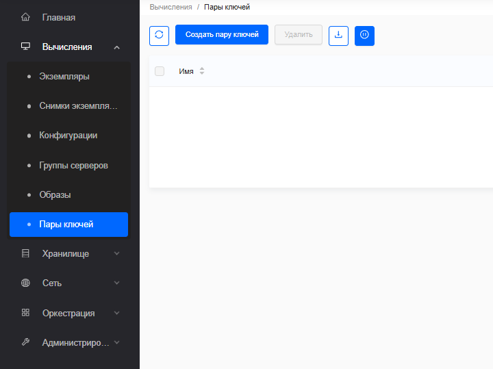
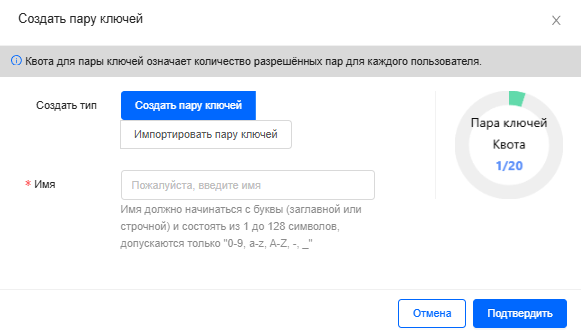
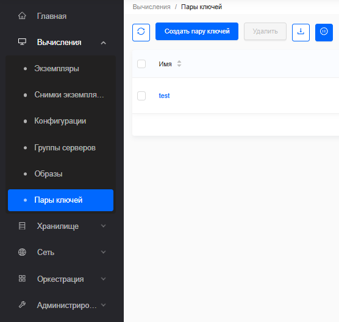
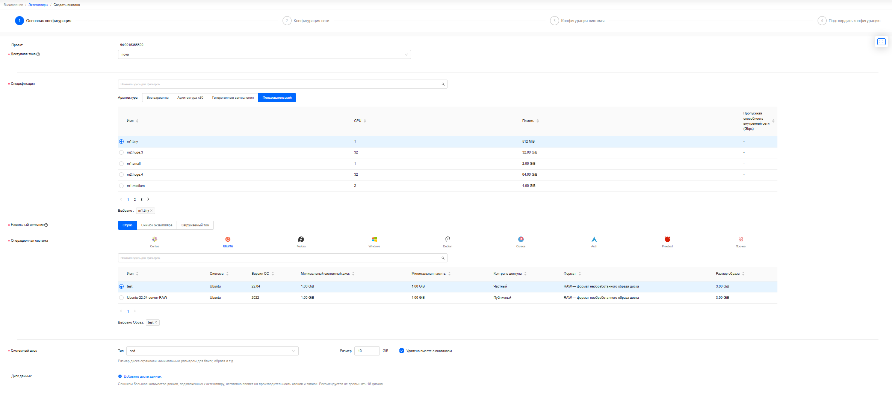
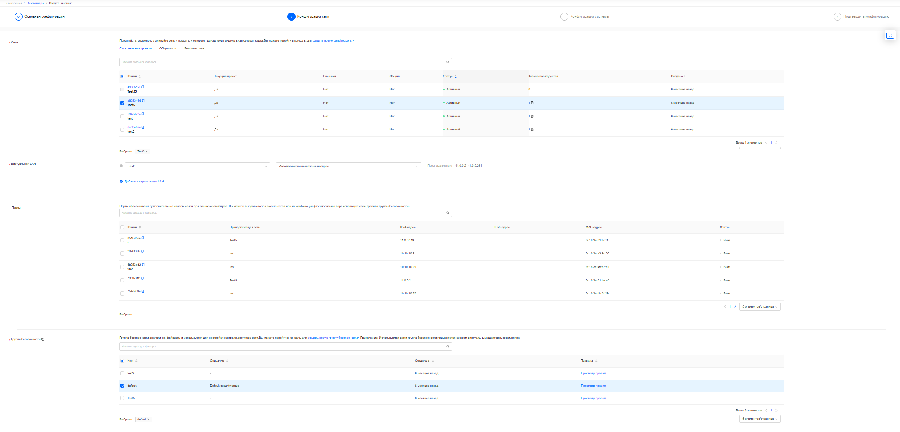
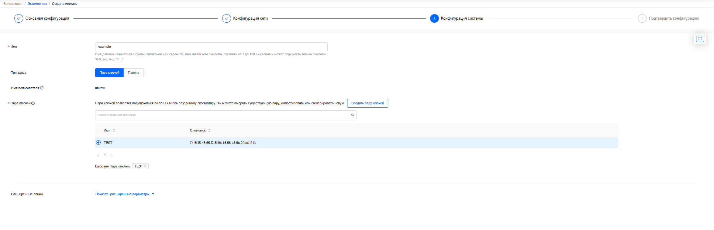
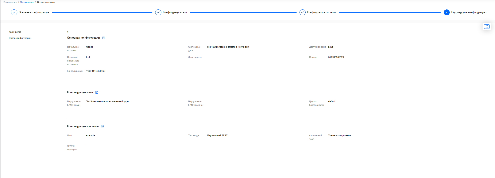

## Создание и управление экземплярами



- Создать пару ключей

    1. Войдите в панель управления
    
    2. Выберите соответствующий проект в меню Переключить проект в верхнем левом углу
    
    3. На странице Консоль откройте вкладку Вычисления и нажмите категорию Пары ключей

    
    
    4. Нажмите Создать пару ключей

    
    
    5. В диалоговом окне Создать тип выберите один из вариантов 
    
    + Тип создания :
    
    • **Создать пару ключей**, если вы выберете этот вариант, введите: Имя
    
    • **Импортировать пару ключей**, если вы выберете этот вариант, отобразится новое поле для Публичного ключа. Введите Имя вашей пары ключей, скопируйте открытый ключ в поле Открытый ключ
    
    7. Нажмите ОК. Панель управления перечисляет пару ключей на вкладке Пары ключей 

    

- Создать и запустить экземпляр

    1. Войдите в панель управления
    
    2. Выберите соответствующий проект в меню Переключить проект в верхнем левом углу.
    
    3. На странице Консоль откройте вкладку Вычисления и нажмите категорию Экземпляры
    
    4. Нажмите Создать экземпляр
    
    5. На странице Создать экземпляр введите значения экземпляра:

    
    
    - **Доступная зона**: зона доступности, из которой будет запущен сервер
    
    - **Спецификация**: выберите flavor для вашего экземпляра сервера
    
    - **Источник запуска**: выберите один из следующих вариантов:
    
    + **Образ**: если вы выберете этот вариант, отобразится новое поле для Операционной системы. Вы можете выбрать образ из списка. И введите размер тома, используемого в качестве Системного диска экземпляра

    

    Нажмите опцию Удалить с экземпляром, чтобы удалить том при удалении экземпляра

    

    + **Снимок экземпляра**: используя этот вариант, вы можете загрузиться из снимка тома и создать новый том, выбрав Снимок экземпляра из списка
    
    + **Загрузочный том**: если вы выберете этот вариант, отобразится новое поле для Загрузочного тома. Вы можете выбрать том из списка

    + **Диск данных**: диски, смонтированные на экземпляре

    6. Нажмите Далее: Сетевая конфигурация. Вы можете выбрать Сети, Порты или их комбинацию для сетевой конфигурации экземпляра

    

    - **Сети**: добавьте сеть к экземпляру. Если вы укажете сети, Виртуальная локальная сеть и Группа безопасности являются обязательными полями

    + **Виртуальная локальная сеть**: укажите подсеть сети и назначьте фиксированный IP-адрес автоматически или вручную для экземпляра

    + **Группа безопасности**: Группы безопасности - это своего рода облачный брандмауэр, который определяет, какой входящий сетевой трафик перенаправляется на экземпляры

    + **Порты**: активируйте порты, которые вы хотите назначить экземпляру

    

    Порт выполняет свои собственные правила группы безопасности по умолчанию

    

    7. Нажмите Далее: Системная конфигурация

    

    - **Имя**: Имя сервера.

    - **Тип входа**: Выберите один из следующих вариантов: 
    
    - **Ключевая пара**: если вы выберете этот вариант, отобразится новое поле для Ключевой пары. Ключевая пара позволяет вам подключаться по SSH к вашему вновь созданному экземпляру. Вы можете выбрать существующую ключевую пару, импортировать ключевую пару или сгенерировать новую ключевую пару
    
    - **Пароль**: введите Пароль для входа и подтвердите его. И вы можете войти в экземпляр, используя пароль

    8. Нажмите Далее: подтвердить конфигурацию и подтвердите свой выбор. Экземпляры создаются, и вы можете подождать несколько секунд, чтобы следить за изменениями данных списка экземпляров или вручную обновить данные, чтобы получить окончательный результат отображения.

    

- 


