## Создание и управление сетями



- Создание сети

    1. Войдите в панель управления

    2. Выберите соответствующий проект из меню Переключить проект в верхнем левом углу

    3. На странице Консоль откройте вкладку Сеть и нажмите категорию Сети

    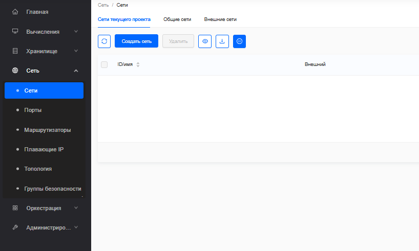

    4. Нажмите Создать сеть

    5. В диалоговом окне Создать сеть укажите следующие значения

    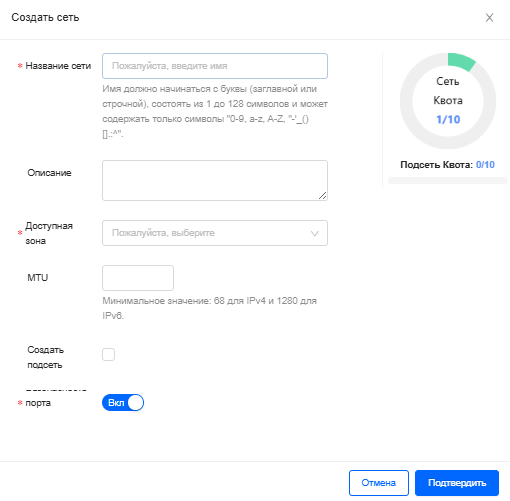

    - **Название сети**: укажите имя для идентификации сети

    

    Имя должно начинаться с буквы (заглавной или строчной), состоять из 1 до 128 символов и может содержать только символы "0-9, a-z, A-Z, "-'_()[].:^

    

    - **Описание**: человекочитаемое описание ресурса

    - **Доступная зона**: выберите зону доступности для сети

    - **Безопасность порта**: выберите статус защиты портов для сети

    - **MTU (Maximum Transmission Unit)**: максимальный размер одного пакета данных, который может быть передан по сети без фрагментации

    

    Минимальное значение: 68 для IPv4 и 1280 для IPv6

    

    - **Создать подсеть**: установите этот флажок, чтобы создать подсеть

    

    При создании сети не обязательно указывать подсеть, но если вы этого не сделаете, сеть нельзя будет подключить к инстансу

    

    - **Название подсети**: укажите имя для подсети

    - **Версия IP**: выберите IPv4 или IPv6

    - **CIDR**: укажите IP-адрес для подсети 

    + Дополнительно: 

    - **Отключить шлюз**: установите этот флажок, чтобы отключить IP-адрес шлюза

    - **IP-адрес шлюза**: укажите IP-адрес для конкретного шлюза. Этот параметр необязателен

    - **DHCP**: установите флажок, чтобы включить или отключить DHCP

    - **Пулы выделения**: укажите пулы IP-адресов

    - **DNS**: укажите DNS-сервер

    - **Маршруты хоста**: укажите IP-адрес маршрутов хоста

    6. Нажмите "Подтвердить"

    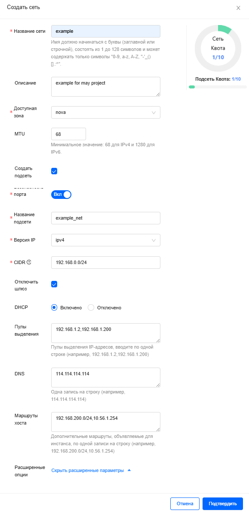

    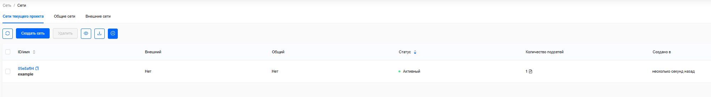   

- Создание маршрутизатора

    1. Войдите в панель управления

    2. Выберите соответствующий проект в меню «Переключить проект» в левом верхнем углу

    3. На странице «Консоль» откройте вкладку «Сеть» и выберите категорию «Маршрутизаторы»

    4. Нажмите «Создать маршрутизатор».

    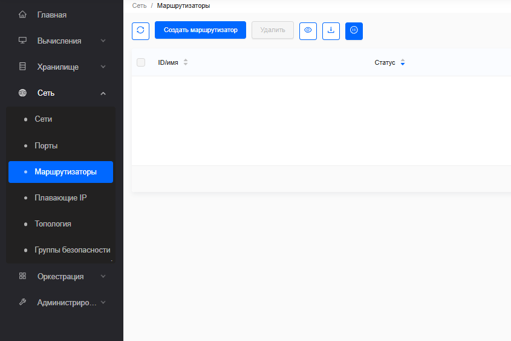

    5. В диалоговом окне «Создание маршрутизатора» укажите следующие значения:

    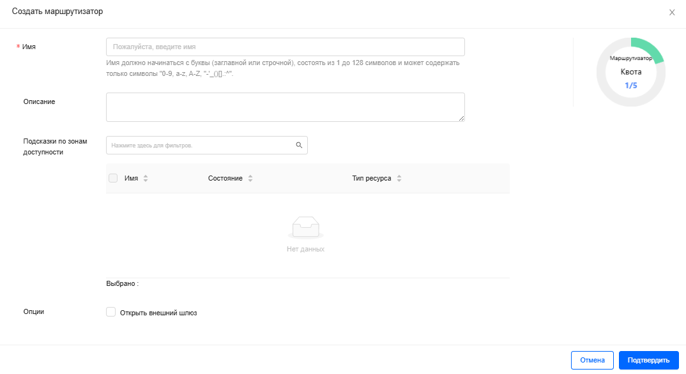

    - **Имя**: укажите имя для идентификации маршрутизатора

    - **Описание**: человекочитаемое описание ресурса

    - **Открыть внешний шлюз**: установите этот флажок, чтобы указать внешний шлюз
    
    - **Внешний шлюз**: укажите внешний шлюз для маршрутизатора

    6. Нажмите «ОК», и новый маршрутизатор отобразится на вкладке «Маршрутизаторы»

    7. Чтобы подключить частную сеть к только что созданному маршрутизатору, выполните следующие действия:

    + На вкладке «Маршрутизаторы» выберите «Ещё» для маршрутизатора и нажмите «Подключить подсеть»

    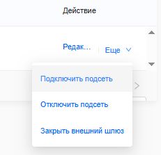
    
    + В диалоговом окне «Подключить подсеть» выберите сеть и подсеть

    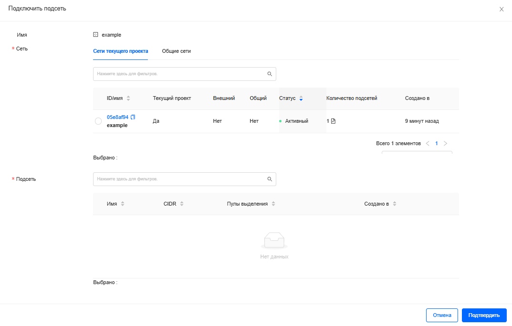
    
    8. Нажмите «ОК»

    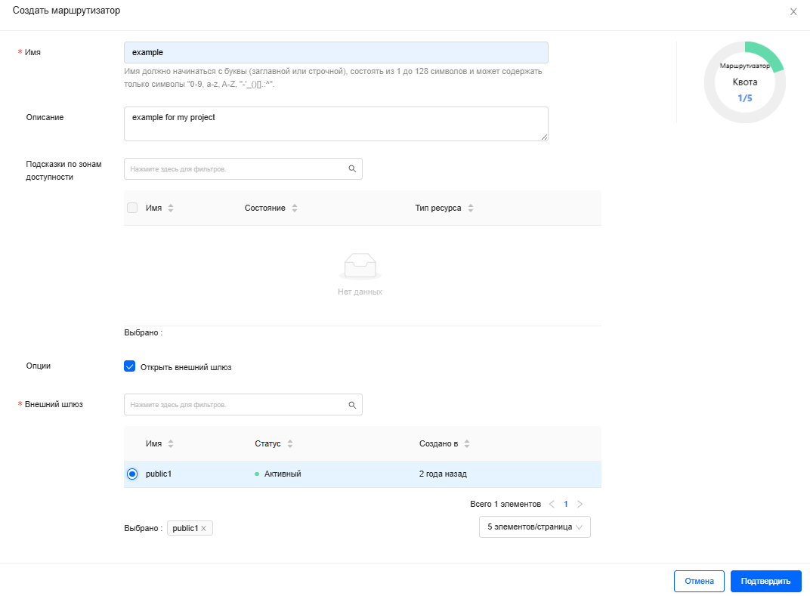

    Вы успешно создали маршрутизатор. Новую топологию можно просмотреть на вкладке «Топология»

    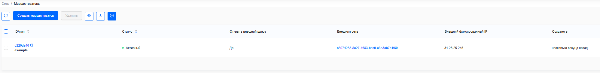

- Cоздание портов

    1. Войдите в панель управления

    2. Выберите соответствующий проект из меню Переключить проект в верхнем левом углу

    3. На странице Консоли откройте вкладку Сеть и нажмите категорию Порты

    4. Нажмите Создать виртуальный адаптер

    

    5. В диалоговом окне Создать виртуальный адаптер укажите следующие значения:

    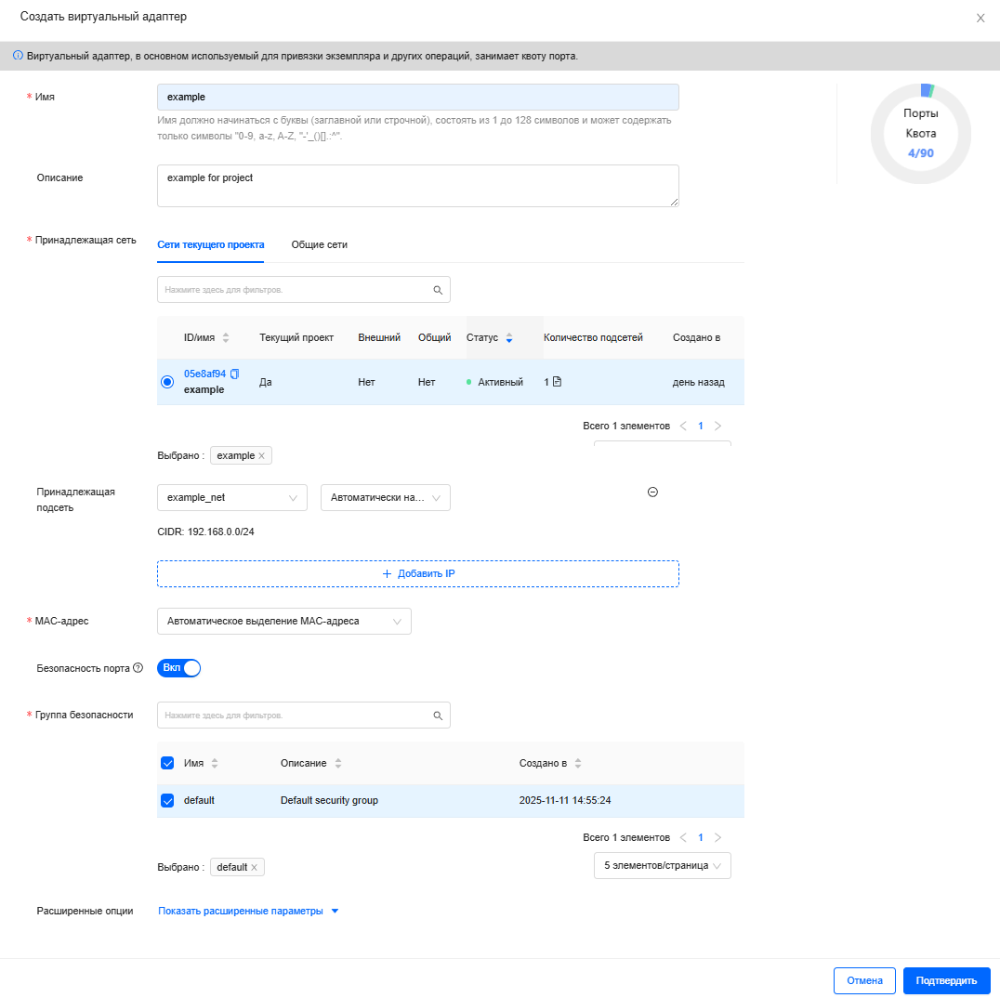

    - **Имя**: укажите имя для идентификации порта

    - **Описание**: человекочитаемое описание ресурса

    - **Принадлежащая сеть**: выберите сеть, прикрепляемую к порту
    
    - **Принадлежащая подсеть**: выберите подсеть, прикрепляемую к порту. 

    

    Если вы укажете как идентификатор подсети, так и IP-адрес, OpenStack попытается выделить IP-адрес на этой подсети для порта. 
    
    Если вы укажете только идентификатор подсети, OpenStack выделит доступный IP из этой подсети для порта.

    
    
    - **Безопасность порта**: установите этот флажок, чтобы указать группу безопасности.
    
    - **Группа безопасности**: выберите группы безопасности, применяемые к порту

    6. Нажмите ОК. Новый порт теперь отображается в списке Порты  

    

- Cоздать fip

    1. Войдите в панель управления

    2. Выберите соответствующий проект из меню Переключить проект в верхнем левом углу

    3. На странице Консоли откройте вкладку Сеть и нажмите категорию Плавающие IP

    4. Нажмите Выделить IP

    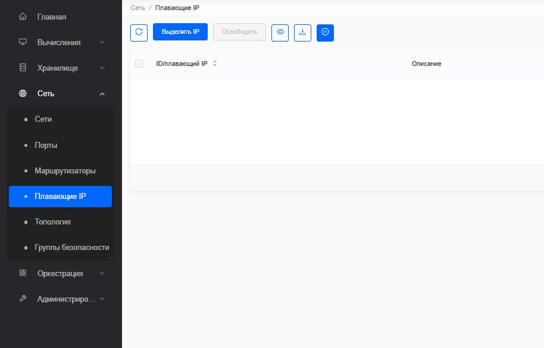

    5. В диалоговом окне Выделить IP укажите следующие значения.

    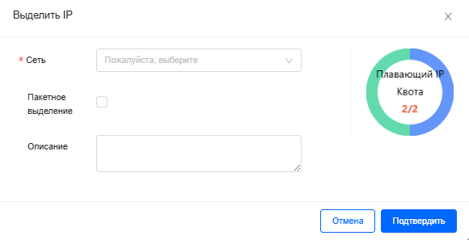
    
    - **Сеть**: укажите сеть, связанную с плавающим IP 
    
    - **Описание**: читаемое человеком описание ресурса
    
    - **Пакетное выделение**: установите этот флажок, чтобы указать количество пакетного создания
    
    - **Количество**: укажите количество пакетного создания

    6. Нажмите ОК. Панель управления показывает плавающий IP на вкладке Плавающие IP

    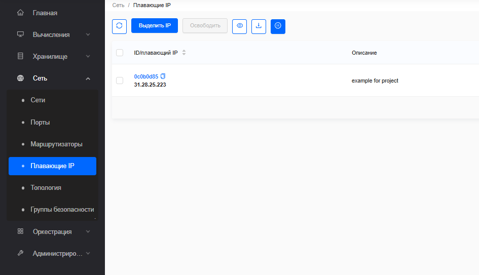

- Cоздане группы безопасности

    1. Войдите в панель управления

    2. Выберите соответствующий проект из меню Переключить проект в верхнем левом углу

    3. На странице Консоли откройте вкладку Сеть и нажмите категорию Группы безопасности

    4. Нажмите Создать группу безопасности

    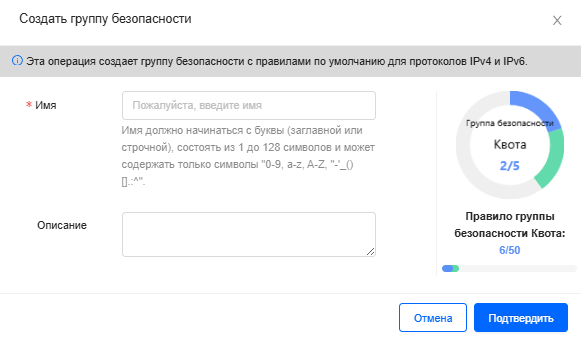

    5. В диалоговом окне Создать группу безопасности укажите 
    
    - **Имя** - укажите имя для идентификации группы безопасности
    
    - **Описание** - человекочитаемое описание ресурса
    
    6. Нажмите ОК, и новая группа безопасности теперь отображается в списке Группы безопасности 

    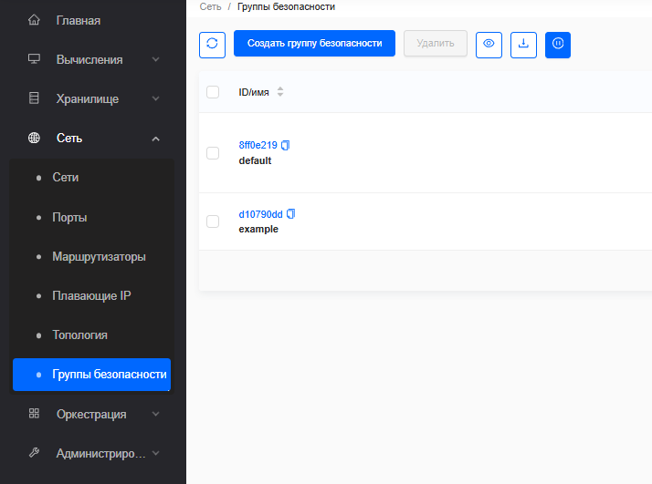



